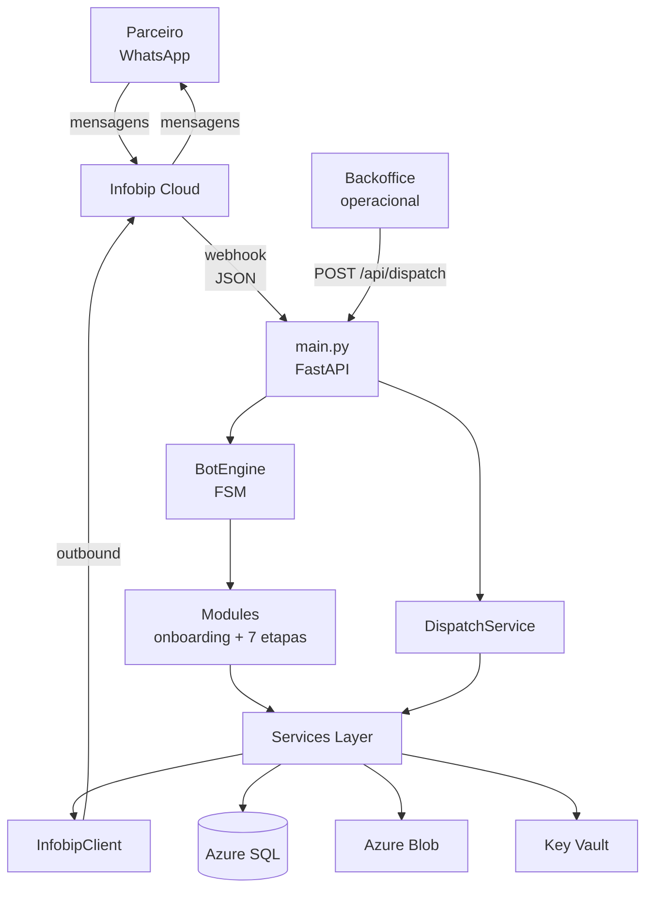
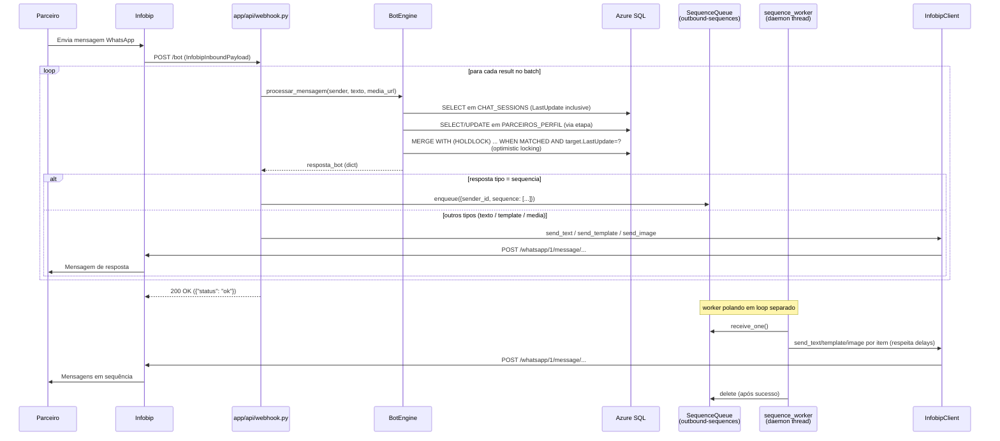
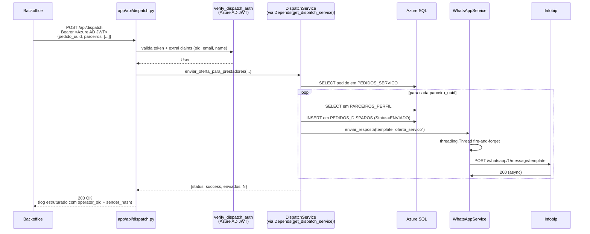
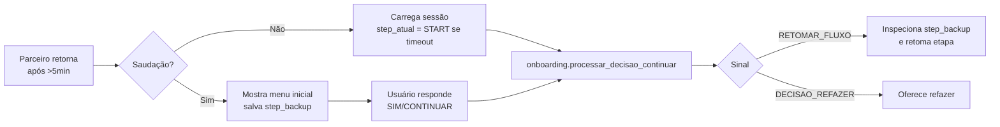

# Arquitetura — Bot Águas do Pará

> Visão de **arquitetura de código** do projeto. Complementa [`Infraestrutura.md`](Infraestrutura.md), que cobre a camada de infra/segurança Azure.

## Visão geral

Aplicação FastAPI que opera um bot WhatsApp para credenciamento de prestadores de serviço (parceiros) no programa Águas do Pará. O parceiro completa um cadastro multi-etapa via chat; o backoffice dispara ofertas de serviço aos parceiros credenciados; o sistema rastreia aceites e ordens de serviço.

Integrações principais:

- **Infobip** — canal WhatsApp (inbound + outbound + mídia)
- **Azure SQL** — persistência de parceiros, sessões, pedidos
- **Azure Blob Storage** — armazenamento de documentos (CNH, RG, selfie)
- **Azure Key Vault** — secrets
- **Application Insights** — telemetria estruturada via `azure-monitor-opentelemetry` (auto-instrumentação + custom dimensions + PII masking + correlation_id por request)

## Componentes



Lista de componentes:

- **`main.py` (FastAPI entrypoint)** — apenas bootstrap. Inicializa telemetria, cria o `FastAPI(lifespan=...)`, popula singletons em `app.state` (`Settings`, `BotEngine`, `DispatchService`, `InfobipClient`, `DLQClient`), aplica middlewares (CORS, rate-limit, correlation_id) e inclui os routers. **Não tem rotas inline.**
- **Routers (`app/api/`)** — agrupados por contexto: `health.py` (`GET /`, `GET /health/ready`), `webhook.py` (`POST /bot`), `dispatch.py` (`POST /api/dispatch`), `admin.py` (`GET /admin/dlq`, `POST /admin/dlq/retry/{id}`). Cada rota recebe seus singletons via `Depends(get_X)` declarado em `app/api/deps.py`.
- **`app/api/deps.py`** — fonte única de auth e injeção de dependências: schemes (`verify_infobip_basic_auth`, `verify_admin_basic_auth`, `verify_dispatch_auth`), getters de state (`get_settings`, `get_bot`, `get_dispatch_service`, `get_infobip_client`, `get_dlq`, `get_sequence_queue`, `get_sender_number`) com 503 fail-safe quando o singleton é `None`, e o `executar_retry_dlq` usado pelo admin.
- **`BotEngine`** (`app/bot_engine.py`) — orquestrador FSM. Carrega sessão, decide a etapa, salva estado com **optimistic locking** (`MERGE WITH (HOLDLOCK) ... WHEN MATCHED AND target.LastUpdate = ?`). Detalhes em [`modules/bot_engine.md`](modules/bot_engine.md).
- **Modules** (`app/modules/`) — etapas do funil de cadastro (`pessoal`, `endereco`, `habilidades`, `veiculos`, `disponibilidade`, `documentos`, `oferta`) + `onboarding` (entrada/decisões iniciais). Detalhes em [`modules/modules.md`](modules/modules.md).
- **Services Layer** (`app/services/`) — `WhatsAppService`, `DispatchService`, `AzureBlobService`, `SessionService` e `sequence_worker` (thread daemon que consome a fila `outbound-sequences`). Persistência do perfil do parceiro fica direto nas etapas (`app/modules/etapa_*.py`) via `DatabaseManager`. Detalhes em [`modules/services.md`](modules/services.md).
- **Integrations** (`app/integrations/` + `app/schemas/`) — `InfobipClient` (HTTP wrapper), `DLQClient` (Azure Storage Queue `outbound-dlq`), `SequenceQueueClient` (Azure Storage Queue `outbound-sequences`) e schemas Pydantic do payload de webhook. Detalhes em [`modules/integrations.md`](modules/integrations.md).
- **Core** (`app/core/`) — `Settings` (Key Vault singleton), `DatabaseManager` (pyodbc + retry), `telemetry` (Application Insights bootstrap + `mask_pii` + `correlation_id_middleware`), `log_dimensions` (vocabulário canônico), `rate_limit` (slowapi + storage Redis lazy-config), `azure_auth` (scheme JWT Azure AD lazy-config) e `retry` (decorator transient). Detalhes em [`modules/core.md`](modules/core.md).

## Fluxos principais

### Fluxo inbound (parceiro envia mensagem)



### Fluxo dispatch (backoffice notifica parceiros)



### Fluxo de retomada após timeout

Quando o parceiro fica inativo por >5 minutos no meio do cadastro, o `BotEngine` força reset visual da sessão mas guarda o ponto anterior em `dados['step_backup']`:



Detalhe da lógica de inspeção do `step_backup` em [`modules/bot_engine.md`](modules/bot_engine.md#3-l%C3%B3gica-central-de-retomada-linhas-138%E2%80%93200).

## Padrão de mensagem

O **contrato comum** entre BotEngine, etapas, `WhatsAppService` e `main.py` é o dict `resposta_bot`. Toda etapa retorna um dict com chave `tipo`:

| `tipo` | Campos | Quem envia |
|---|---|---|
| `texto` | `conteudo: str` | `WhatsAppService.send_text` ou `InfobipClient.send_text` |
| `media` | `url: str`, `legenda: str` | `send_image` |
| `template` | `template_name: str`, `placeholders: list[str]`, `language: str` (opcional) | `send_template` |
| `combo_inicial` | `texto: str` + campos de `template` | `send_text` (texto) + `send_template` (após 0.5s) |
| `sequencia` | `mensagens: list[dict]` (cada item com `tipo` + `delay: float`) | **Enqueue** em `outbound-sequences` (Azure Storage Queue); `sequence_worker` consome e respeita delays |

**Por que esse padrão existe:** desacopla as etapas do canal de envio. As etapas retornam intenção; quem decide como entregar é o `WhatsAppService` ou o `main.py`. Trocar de provedor não exige tocar nas etapas.

⚠ **Pendência da migração**: alguns lugares ainda emitem `template_sid` + `variaveis` (formato Twilio) em vez de `template_name` + `placeholders`. Ver "Pontos de fragilidade" abaixo.

## Decisões-chave

### Singleton de `Settings` com cache local

Justificativa: o Key Vault tem latência (~50–100ms por leitura) e cota. Cachear em processo evita round-trips repetidos. **Trade-off**: pra pegar rotação de secret é preciso reiniciar o app — aceitável dada a baixa frequência.

### Lifespan + lazy-init de subsistemas com I/O

`main.py` usa `@asynccontextmanager` `lifespan` (substitui `@app.on_event`, deprecado). No startup, **antes do `yield`**, são chamados em ordem:

1. `configure_redis_storage(redis_conn)` (em `app/core/rate_limit.py`) — troca o storage do `slowapi` de in-memory para Redis usando a connection string do Key Vault. Era inicializado no `import` antes, o que rodava em cada boot de worker Gunicorn mesmo antes do app receber tráfego.
2. `configure_azure_auth(settings)` (em `app/core/azure_auth.py`) — instancia `SingleTenantAzureAuthorizationCodeBearer` usando `AZURE-AD-TENANT-ID` e `AZURE-AD-API-CLIENT-ID`. Também removido do module-load.
3. `SequenceQueueClient()` + `sequence_worker.start_worker()` — sobe a thread daemon que consome `outbound-sequences`.

**Por que esse pattern existe:** Settings + Key Vault custavam I/O em cada module-load. Com 4 workers Gunicorn × N instâncias App Service, isso são N×4 leituras Key Vault só pra subir o processo. Movendo pra lifespan, o I/O acontece uma vez por processo, depois que o Settings singleton já está populado em `app.state` — e nada do que falha no startup derruba o caminho normal do webhook (cada subsistema tem `try/except` + 503 guard).

### Routers em `app/api/` + injeção via `Depends()`

`main.py` apenas inclui routers; toda rota vive em `app/api/{health,webhook,admin,dispatch}.py`. Cada handler declara dependências explicitamente:

```python
@router.post("/api/dispatch", dependencies=[Depends(verify_dispatch_auth)])
def dispatch(
    payload: DispatchRequest,
    user = Depends(verify_dispatch_auth),
    svc: DispatchService = Depends(get_dispatch_service),
):
    ...
```

Os getters em `app/api/deps.py` (`get_bot`, `get_dispatch_service`, `get_infobip_client`, `get_dlq`, `get_sequence_queue`, `get_settings`, `get_sender_number`) extraem o singleton de `request.app.state` e levantam **503** se for `None` (significa que o startup falhou pra aquele subsistema). Exceção: `get_sequence_queue` retorna `None` sem 503 — enqueue é fire-and-forget, o handler já checa.

**Por que esse pattern existe (vs `request.app.state.X` direto):**

- Validação "está inicializado?" centralizada em um único lugar (DRY)
- Routers ficam testáveis com `app.dependency_overrides[get_X] = lambda: mock` — sem precisar tocar `app.state` durante o teste (ver `docs/TESTING.md`)
- A assinatura da rota declara dependências explicitamente

### Optimistic locking em `CHAT_SESSIONS`

Dois webhooks da Infobip podem chegar quase simultâneos pro mesmo `WhatsAppID` (mensagens em sequência rápida). Sem locking, ambos lêem o mesmo estado, processam, e o segundo sobrescreve o trabalho do primeiro. `BotEngine._save_session` evita isso com **MERGE + HOLDLOCK + comparação de `LastUpdate`**:

```sql
MERGE CHAT_SESSIONS WITH (HOLDLOCK) AS target
USING (SELECT ? AS WhatsAppID) AS source
ON (target.WhatsAppID = source.WhatsAppID)
WHEN MATCHED AND target.LastUpdate = ? THEN
    UPDATE SET CurrentStep = ?, TempData = ?, LastUpdate = GETDATE()
WHEN NOT MATCHED THEN
    INSERT (WhatsAppID, CurrentStep, TempData, LastUpdate)
    VALUES (?, ?, ?, GETDATE());
```

- `_get_session` retorna `(step, dados, last_update)` — o caller propaga `last_update` pro `_save_session`.
- `WHEN MATCHED AND target.LastUpdate = ?` evita sobrescrever se outro request alterou a linha no meio do caminho — `rowcount=0` revela o conflito.
- `WITH (HOLDLOCK)` serializa o predicate de existência (race clássica do UPSERT: dois workers ambos veem "linha não existe" e tentam INSERT simultâneo).

### Fila + worker pra mensagens em sequência

Respostas do tipo `sequencia` (várias mensagens com `delay` entre elas, comum em onboarding e validação de CNPJ) **não usam `BackgroundTasks` do FastAPI**. Razão: `BackgroundTasks` roda no thread pool do anyio (~36 threads); `time.sleep` longo (ex: 30s) segura uma thread inteira até o fim, podendo exaurir o pool em picos de tráfego.

Em vez disso, o webhook **enfileira** o payload em `outbound-sequences` (Azure Storage Queue) e o `sequence_worker` (thread daemon iniciada no lifespan startup) consome em loop:

- `receive_one()` com `visibility_timeout=300s` (5 min) — se o processo cair no meio, a mensagem reaparece e outro worker pega.
- Para cada item da sequência: respeita `delay`, chama `InfobipClient.send_*`, repete até esgotar.
- Em falha: **não deleta** — Storage Queue redeliveria após visibility timeout; `dequeue_count` incrementa; se passar de `POISON_THRESHOLD=5`, deleta + log `CRITICAL` (evita loop infinito).
- Em sucesso: deleta a mensagem.

**Trade-off conhecido:** se um envio falha no meio, ao reaparecer o usuário recebe as primeiras N mensagens duplicadas. Aceitável a 100 conversas/dia (< 0.1% das sequências estimadas). Mitigação futura: tracker `sent_index` no payload.

### Retry exponencial no `DatabaseManager`

Azure SQL Serverless pode demorar até 1 minuto pra acordar de pausa. Sem retry, o primeiro request após inatividade falha. O retry classifica códigos transientes (`08001`, `HYT00`, `08S01`, `10054`) e faz backoff `2 * (2^n) + jitter`. Erros permanentes (sintaxe, FK) não disparam retry.

### Threading no envio outbound (apenas para tipos simples)

`WhatsAppService.enviar_resposta` dispara `threading.Thread` para mensagens dos tipos `texto`, `template` e `media` — não bloqueia o caller (webhook ou dispatch) e a latência fim-a-fim cabe em milissegundos. **Trade-off**: se a app cai, esse envio em voo é perdido. Aceito porque tipos simples são "fire-and-forget" sem ordenação.

⚠ **Tipo `sequencia` NÃO usa esse caminho** — vai pra fila `outbound-sequences` + `sequence_worker` (ver decisão "Fila + worker pra mensagens em sequência" acima). Sequências têm `delay` entre itens, e segurar threads `time.sleep` exaure o pool sob carga.

### Sem fallback de resposta (post-migração) + DLQ assistida

Antes da migração Twilio→Infobip, o webhook respondia com TwiML como salvaguarda. Hoje, se a chamada outbound falha após retries transientes (timeout/5xx, 2 tentativas via `app/core/retry.py`), a falha é **persistida na DLQ** (Azure Storage Queue `outbound-dlq`, ver `app/integrations/dlq.py`) e o parceiro não recebe na hora — mas a mensagem é recuperável manualmente via `POST /admin/dlq/retry/{message_id}` (autenticado com `ADMIN-USER`/`ADMIN-PASSWORD`). Lista pendente via `GET /admin/dlq` (peek).

**Política da DLQ (intencional):** apenas persiste, sem retry automático. Cada mensagem tem 1 ciclo — enqueue → admin retry manual → delete **obrigatório** (sucesso ou falha do retry). Evita fila poluída com mensagens fantasmas re-tentando sozinhas. Service Bus foi descartado por estar fora do escopo; Storage Queue resolve com semântica simples e custo desprezível.

### Autenticação do `/api/dispatch` via Azure AD JWT (Bearer)

`/api/dispatch` é o único endpoint que recebe ações de usuários humanos (operadores do backoffice disparando ofertas). Por isso usa **OAuth 2.0 / OpenID Connect via Azure AD** em vez de Basic Auth.

**Por que Azure AD aqui (e não Basic Auth):**

- Cada chamada carrega identidade do operador (`oid`, email, name) — auditoria de quem disparou cada dispatch
- Senha do operador nunca chega no bot (apenas JWT assinado)
- Revogar acesso = desativar conta Azure AD (não precisa rotacionar credencial compartilhada)
- Suporta MFA, conditional access, group-based permissions sem código adicional

**Implementação:**

- `app/core/azure_auth.py` expõe `configure_azure_auth(settings) -> bool` que instancia `SingleTenantAzureAuthorizationCodeBearer` (lib `fastapi-azure-auth`) com `AZURE-AD-TENANT-ID` e `AZURE-AD-API-CLIENT-ID`. **Não roda no module-load** — é chamado pelo `lifespan` startup em `main.py`, usando o mesmo `Settings` singleton já populado em `app.state.settings`.
- `get_azure_scheme()` retorna o scheme atual (ou `None` se ainda não configurado). O wrapper `verify_dispatch_auth` em `app/api/deps.py` lê dinamicamente a cada request — sem cachear módulo-local, o configure tardio é visto imediatamente.
- Validação JWT é **offline** — chaves públicas do tenant são cacheadas (24h refresh).
- Fail-safe: 503 se secrets ausentes / configure ainda não rodou, 401 se token inválido.
- Log estruturado registra `operator_oid` e hash do email (`mask_pii`) em cada dispatch — `app/api/dispatch.py` já loga as duas dimensões.

Setup completo do App Registration + integração MSAL.js no backoffice: `docs/AUTH-AZURE-AD.md`.

### Autenticação do webhook via Basic Auth + comparação constant-time

A Infobip envia `Authorization: Basic <base64(user:password)>` em cada request a `POST /bot`, conforme perfil de segurança configurado no portal. A dependência FastAPI `verify_infobip_basic_auth` (em `app/api/deps.py`) lê `INFOBIP-WEBHOOK-USER` e `INFOBIP-WEBHOOK-PASSWORD` do Key Vault e valida com `secrets.compare_digest` (constant-time — previne timing attacks). É injetada como `dependencies=[Depends(verify_infobip_basic_auth)]` na rota em `app/api/webhook.py`.

**Trade-off intencional:** o endpoint é **fail-safe**, não fail-open:
- Se as credenciais **não estão configuradas** no Key Vault, retorna **503** + log critical. Sem auth configurada == sem serviço.
- Se as credenciais **estão configuradas mas a request é inválida**, retorna **401** + log warning.

Justificativa: erro humano de configuração (esquecer de provisionar o secret após o deploy) **não pode** abrir o webhook pro mundo. Forçar 503 obriga o sysadmin a configurar antes do go-live.

### Rate limit com storage Redis compartilhado

`slowapi` aplica limites por IP em endpoints sensíveis: `/bot` 30/min, `/admin/*` 20/min, `/api/dispatch` 10/min. `GET /` e `GET /health/ready` sem limite (probe Azure precisa bater frequentemente).

**Storage: Redis (não in-memory).** Por quê:

- Gunicorn roda 4 workers (cada processo Python tem memória isolada)
- App Service escala 1 → N instâncias sob carga
- Sem estado compartilhado, "10/min" vira "10/min × workers × instâncias" = 40-200/min na prática

Azure Cache for Redis Basic C0 centraliza o contador. Limite configurado = limite efetivo, independente de escala. Fallback automático para in-memory se Redis indisponível (degradação parcial, não quebra).

Connection string no Key Vault como `REDIS-CONNECTION-STRING`. Parse de formato Azure (`host:port,password=X,ssl=True`) para URI slowapi (`rediss://:X@host:port/0`) em `app/core/rate_limit.py`.

`configure_redis_storage(connection_string)` é chamado **no lifespan startup**, não no module-load — troca o storage do `Limiter` (que nasce in-memory) pra Redis em tempo de boot, depois que o `Settings` singleton já está populado. Se a connection string estiver ausente ou Redis cair, o `Limiter` continua funcionando in-memory (degradação parcial, não quebra).

### Alertas operacionais via Azure Monitor

11 alert rules configuradas no Application Insights, agrupadas por severidade:

- **Sev 1** (incidente em horário comercial): `/health/ready` 503, `/bot` retornando 5xx, DLQ crescendo rápido, brute force em `/admin/*`, vazamento de PII em logs.
- **Sev 2** (atenção em horas): SQL latency p95 alto, Infobip 4xx, rate limit hits em massa, CPU > 80% sustained.
- **Sev 3** (review semanal): mock CNPJ ainda em uso, cold starts SQL Serverless excessivos.

Notificação via email para Action Group `ag-aguasdopara-devops-{env}`. Setup completo + queries Kusto + runbook de incidente em `docs/MONITORING.md`.

Custo estimado: ~R$ 25/mês para todas as regras. Trade-off explícito vs prejuízo potencial de incidente não detectado (créditos Infobip drenados, suspensão WhatsApp).

### Health checks: liveness vs readiness separados

Dois endpoints distintos pra deixar claro o que cada um significa:

- `GET /` (liveness): responde 200 enquanto o processo está vivo. **Não checa dependências.** Usado pelo container/App Service para "o app está rodando?".
- `GET /health/ready` (readiness): checa SQL (`SELECT 1`), Infobip (client inicializado + sender configurado), Storage Queue (`get_queue_properties` na fila DLQ), e Key Vault (lê secret sentinel). Retorna 200 se tudo OK ou **503** se qualquer dependência falhar. Body inclui detalhe de cada check em ambos os casos — permite dashboard mostrar exatamente o que está com problema.

Configurar o `healthCheckPath` do App Service para `/health/ready` (não `/`) — assim, se SQL ou Storage caem, App Service para de rotear tráfego automaticamente. Detalhes em `docs/DEPLOYMENT.md` seção 5.1.

Sem auth: readiness probe do App Service não envia credenciais. Endpoint público é intencional.

### Telemetria com correlation_id middleware e PII masking

Toda request ganha um `operation_id` (gerado por `correlation_id_middleware` em `app/core/telemetry.py`) que é injetado em todas as `custom_dimensions` dos logs subsequentes via `logging.Filter`. Permite query Kusto tipo "todos os logs desta mensagem" no App Insights.

Identificadores PII (WhatsApp ID, CPF, CNPJ, email) são mascarados com `mask_pii()` — SHA-256 truncado + salt em env var (`LOG_PII_SALT`, rotacionável). É determinístico — permite correlacionar logs do mesmo usuário sem expor identificador (atende LGPD).

`azure-monitor-opentelemetry` instrumenta automaticamente FastAPI (requests), `requests`/`httpx` (HTTP outbound) e `pyodbc` (SQL queries) — não há logs manuais nesses caminhos.

### State machine textual em `BotEngine`

Estados são strings (`'AGUARDANDO_CNPJ'`, `'INICIAR_VEICULOS'`, etc) gravadas em `CHAT_SESSIONS.CurrentStep`. Roteamento é um grande `if/elif/elif` em `processar_mensagem`. **Por que não FSM declarativa**: a ordem dos elifs codifica precedência; alguns ramos usam `startswith` (prefixo) em vez de match exato. Refatorar pra tabela tem alto risco de bug sutil. Aceitar o switch grande como custo da clareza linear.

### Wrapper `WhatsAppService` sobre `InfobipClient`

`WhatsAppService` poderia parecer redundante (mais uma camada). Justificativa: preserva a **interface pública** que o restante do código já usava (`enviar_resposta(dict)`), permitindo a migração não tocar callers como `DispatchService`. Custo: 1 arquivo a mais. Benefício: blast radius da migração reduzido.

## Pontos de fragilidade conhecidos

Itens que valeria endereçar (ordem de impacto):

1. ~~**Templates Twilio não migrados em `app/modules/onboarding.py`**~~ — **Resolvido**. Os SIDs `HX...` foram removidos. (Histórico: era pendência da migração Twilio→Infobip; checada em `git grep 'HX[a-f0-9]{32}'` → vazio.)

2. **Payload de template inconsistente** — `onboarding.py` ainda monta dicts inline com `template_sid` + `variaveis` (formato Twilio antigo). Após migração Infobip, deveria ser `template_name` + `placeholders` (lista). Funcionará via fallback `_dict_to_positional_list` em `WhatsAppService`, mas é frágil — se a ordem das chaves do dict não for `'1', '2', ...` previsível, o resultado é errado. (Histórico: também havia `GeradorResposta.template` em `app/modules/common.py` com o mesmo problema; removida em `chore/remove-parceiro-service` por ser dead code.)

3. ~~**Sem dead-letter queue em envios outbound**~~ — **Resolvido**. Retry transient (`app/core/retry.py`: 2 tentativas, backoff exponencial, só em timeout/connection error/5xx) + persistência das falhas pós-retry na Azure Storage Queue `outbound-dlq` (`app/integrations/dlq.py`). Recuperação manual via endpoints admin `GET /admin/dlq` (lista) e `POST /admin/dlq/retry/{message_id}` (re-executa + delete obrigatório). Política: 1 tentativa manual por mensagem; sem retry automático — evita fila poluída.

4. ~~**Webhook sem autenticação**~~ — **Resolvido**. `POST /bot` agora valida `Basic Auth` via `verify_infobip_basic_auth` (dependência FastAPI). Credenciais em Key Vault (`INFOBIP-WEBHOOK-USER` + `INFOBIP-WEBHOOK-PASSWORD`). Comparação `secrets.compare_digest` (constant-time). Fail-safe: 503 se as credenciais não estiverem configuradas; 401 se inválidas.

5. **Mock de validação de CNPJ em produção** — inline em `etapa_pessoal.processar_cnpj` (regra fake "termina em 0000 é inválido"). Trocar por integração real (Serpro/Receita Federal) antes de prod. ViaCEP e Google Maps já são chamadas reais em `etapa_endereco.py`.

6. ~~**CORS aberto**~~ — **Resolvido**. CORS configurado via env var `ALLOWED_ORIGINS` (comma-separated). Sem env var = lista vazia (fail-safe). Methods restritos a `GET`/`POST`/`OPTIONS`, headers restritos a `Authorization`/`Content-Type`. Setup em `DEPLOYMENT.md` passo 5. NÃO usar wildcard `*.azurewebsites.net` (qualquer um cria subdomínio Azure).

7. ~~**Logs via `print` + `traceback.print_exc()`**~~ — **Resolvido** pelo PR `chore/structured-logging`. Hoje: `logger` estruturado por módulo + custom dimensions canônicas + PII masking + correlation_id middleware. Ver seção "Decisões-chave" e [`modules/core.md → Telemetria`](modules/core.md).

8. ~~**Sem rate limit**~~ — **Resolvido**. `slowapi` aplicado nos endpoints: `/bot` 30/min, `/admin/*` 20/min, `/api/dispatch` 10/min. Storage compartilhado via Azure Cache for Redis (`REDIS-CONNECTION-STRING` no Key Vault) — essencial com Gunicorn 4 workers + scaling automático (sem isso, limite efetivo multiplica por N_workers × N_instâncias). Fallback in-memory se Redis cair. Setup em `DEPLOYMENT.md` passo 2.7.

9. **`DatabaseManager` sem pool de conexões** — cada query abre/fecha conexão `pyodbc`. A 100 conversas/dia o custo é tolerável, mas com pico ou crescimento o setup TCP+TLS+login do SQL vira gargalo dominante. Endereçar via `pyodbc` pooling OS-level (já habilitado por default em algumas plataformas) ou `aioodbc` + asyncpg-like pool para o caminho FastAPI async.

10. **`time.sleep` síncrono em handlers FastAPI** — alguns caminhos de validação (ex: CNPJ mock com `time.sleep(30)`) bloqueiam threads do anyio pool. O `sequence_worker` já evita isso pro tipo `sequencia`, mas chamadas pontuais (validação inline, etapas) ainda bloqueiam. Migrar pra `run_in_threadpool` ou `asyncio.sleep` quando o handler for `async`.

## Recursos externos

| Recurso | Propósito | Configuração |
|---|---|---|
| Azure Key Vault | Secrets centralizados | env `AZURE_KEYVAULT_URL` |
| Azure SQL Server | Persistência | Secrets `DB-SERVER`, `DB-NAME`, `DB-USER`, `DB-PASSWORD` |
| Azure Blob Storage | Documentos legais | Secret `CONNECTION-STRING-AZURE-STORAGE` |
| Infobip (WhatsApp) | Canal de chat | Secrets `INFOBIP-API-KEY`, `INFOBIP-BASE-URL`, `INFOBIP-SENDER` |
| Application Insights | Telemetria, logs estruturados, traces | env `APPLICATIONINSIGHTS_CONNECTION_STRING` |
| Google Maps API (futuro) | Geolocation real | Atualmente mockada |
| Serpro / Receita Federal (futuro) | Validação de CNPJ | Atualmente mockada |

## Diretórios

| Pasta | Responsabilidade | Doc |
|---|---|---|
| `app/core/` | Config + DB | [modules/core.md](modules/core.md) |
| `app/integrations/` + `app/schemas/` | Cliente e schemas Infobip | [modules/integrations.md](modules/integrations.md) |
| `app/services/` | Camada de aplicação | [modules/services.md](modules/services.md) |
| `app/modules/` | Etapas do funil + helpers | [modules/modules.md](modules/modules.md) |
| `app/bot_engine.py` | Orquestrador FSM | [modules/bot_engine.md](modules/bot_engine.md) |
