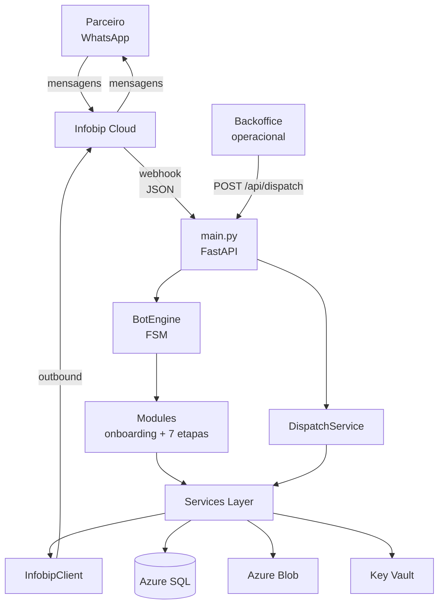
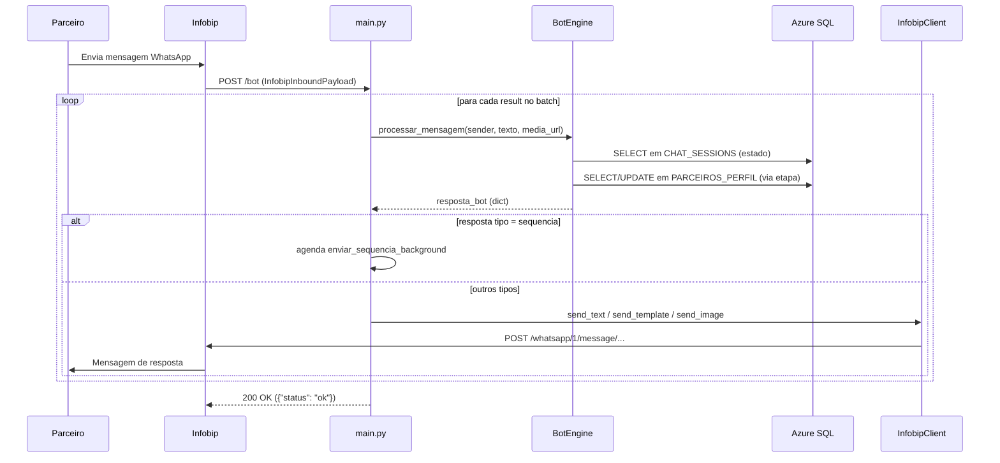
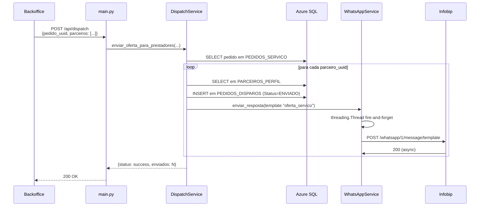
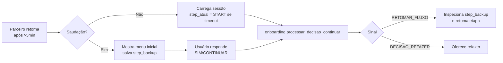

# Arquitetura — Bot Águas do Pará

> Visão de **arquitetura de código** do projeto. Complementa [`Infraestrutura.md`](Infraestrutura.md), que cobre a camada de infra/segurança Azure.

## Visão geral

Aplicação FastAPI que opera um bot WhatsApp para credenciamento de prestadores de serviço (parceiros) no programa Águas do Pará. O parceiro completa um cadastro multi-etapa via chat; o backoffice dispara ofertas de serviço aos parceiros credenciados; o sistema rastreia aceites e ordens de serviço.

Integrações principais:

- **Infobip** — canal WhatsApp (inbound + outbound + mídia)
- **Azure SQL** — persistência de parceiros, sessões, pedidos
- **Azure Blob Storage** — armazenamento de documentos (CNH, RG, selfie)
- **Azure Key Vault** — secrets
- **Application Insights** — telemetria estruturada via `azure-monitor-opentelemetry` (auto-instrumentação + custom dimensions + PII masking + correlation_id por request)

## Componentes

Lista de componentes:

- **`main.py` (FastAPI)** — expõe `/bot` (webhook inbound) e `/api/dispatch` (API de notificação). Faz parsing, delega ao `BotEngine` ou `DispatchService`, e dispara o envio outbound via `InfobipClient`.
- **`BotEngine`** (`app/bot_engine.py`) — orquestrador FSM. Carrega sessão, decide a etapa, salva estado, retorna resposta. Detalhes em [`modules/bot_engine.md`](modules/bot_engine.md).
- **Modules** (`app/modules/`) — etapas do funil de cadastro (`pessoal`, `endereco`, `habilidades`, `veiculos`, `disponibilidade`, `documentos`, `oferta`) + `onboarding` (entrada/decisões iniciais). Detalhes em [`modules/modules.md`](modules/modules.md).
- **Services Layer** (`app/services/`) — `WhatsAppService`, `DispatchService`, `AzureBlobService`, `SessionService`. Encapsulam integrações externas (WhatsApp via Infobip, Blob Storage, dispatch). Persistência do perfil do parceiro fica direto nas etapas (`app/modules/etapa_*.py`) via `DatabaseManager`. Detalhes em [`modules/services.md`](modules/services.md).
- **Integrations** (`app/integrations/` + `app/schemas/`) — `InfobipClient` (HTTP wrapper) e schemas Pydantic do payload de webhook. Detalhes em [`modules/integrations.md`](modules/integrations.md).
- **Core** (`app/core/`) — `Settings` (Key Vault singleton), `DatabaseManager` (pyodbc + retry), `telemetry` (Application Insights bootstrap + `mask_pii` + `correlation_id_middleware`) e `log_dimensions` (vocabulário canônico de dimensions). Detalhes em [`modules/core.md`](modules/core.md).

## Fluxos principais

### Fluxo inbound (parceiro envia mensagem)

### Fluxo dispatch (backoffice notifica parceiros)

### Fluxo de retomada após timeout

Quando o parceiro fica inativo por >5 minutos no meio do cadastro, o `BotEngine` força reset visual da sessão mas guarda o ponto anterior em `dados['step_backup']`:

Detalhe da lógica de inspeção do `step_backup` em [`modules/bot_engine.md`](modules/bot_engine.md#3-l%C3%B3gica-central-de-retomada-linhas-138%E2%80%93200).

## Padrão de mensagem

O **contrato comum** entre BotEngine, etapas, `WhatsAppService` e `main.py` é o dict `resposta_bot`. Toda etapa retorna um dict com chave `tipo`:

| `tipo` | Campos | Quem envia |
|---|---|---|
| `texto` | `conteudo: str` | `WhatsAppService.send_text` ou `InfobipClient.send_text` |
| `media` | `url: str`, `legenda: str` | `send_image` |
| `template` | `template_name: str`, `placeholders: list[str]`, `language: str` (opcional) | `send_template` |
| `combo_inicial` | `texto: str` + campos de `template` | `send_text` (texto) + `send_template` (após 0.5s) |
| `sequencia` | `mensagens: list[dict]` (cada item com `tipo` + `delay: float`) | Background task com `time.sleep` |

**Por que esse padrão existe:** desacopla as etapas do canal de envio. As etapas retornam intenção; quem decide como entregar é o `WhatsAppService` ou o `main.py`. Trocar de provedor não exige tocar nas etapas.

⚠ **Pendência da migração**: alguns lugares ainda emitem `template_sid` + `variaveis` (formato Twilio) em vez de `template_name` + `placeholders`. Ver "Pontos de fragilidade" abaixo.

## Decisões-chave

### Singleton de `Settings` com cache local

Justificativa: o Key Vault tem latência (~50–100ms por leitura) e cota. Cachear em processo evita round-trips repetidos. **Trade-off**: pra pegar rotação de secret é preciso reiniciar o app — aceitável dada a baixa frequência.

### Retry exponencial no `DatabaseManager`

Azure SQL Serverless pode demorar até 1 minuto pra acordar de pausa. Sem retry, o primeiro request após inatividade falha. O retry classifica códigos transientes (`08001`, `HYT00`, `08S01`, `10054`) e faz backoff `2 * (2^n) + jitter`. Erros permanentes (sintaxe, FK) não disparam retry.

### Threading no envio outbound

`WhatsAppService.enviar_resposta` dispara `threading.Thread` para não bloquear o caller (webhook handler ou dispatch). **Trade-off**: se a app cai, mensagens em voo são perdidas — sem fila persistente. Endereçar via Service Bus + worker se a operação ficar crítica.

### Sem fallback de resposta (post-migração) + DLQ assistida

Antes da migração Twilio→Infobip, o webhook respondia com TwiML como salvaguarda. Hoje, se a chamada outbound falha após retries transientes (timeout/5xx, 2 tentativas via `app/core/retry.py`), a falha é **persistida na DLQ** (Azure Storage Queue `outbound-dlq`, ver `app/integrations/dlq.py`) e o parceiro não recebe na hora — mas a mensagem é recuperável manualmente via `POST /admin/dlq/retry/{message_id}` (autenticado com `ADMIN-USER`/`ADMIN-PASSWORD`). Lista pendente via `GET /admin/dlq` (peek).

**Política da DLQ (intencional):** apenas persiste, sem retry automático. Cada mensagem tem 1 ciclo — enqueue → admin retry manual → delete **obrigatório** (sucesso ou falha do retry). Evita fila poluída com mensagens fantasmas re-tentando sozinhas. Service Bus foi descartado por estar fora do escopo; Storage Queue resolve com semântica simples e custo desprezível.

### Autenticação do `/api/dispatch` via Azure AD JWT (Bearer)

`/api/dispatch` é o único endpoint que recebe ações de usuários humanos (operadores do backoffice disparando ofertas). Por isso usa **OAuth 2.0 / OpenID Connect via Azure AD** em vez de Basic Auth.

**Por que Azure AD aqui (e não Basic Auth):**

- Cada chamada carrega identidade do operador (`oid`, email, name) — auditoria de quem disparou cada dispatch
- Senha do operador nunca chega no bot (apenas JWT assinado)
- Revogar acesso = desativar conta Azure AD (não precisa rotacionar credencial compartilhada)
- Suporta MFA, conditional access, group-based permissions sem código adicional

**Implementação:**

- `app/core/azure_auth.py` instancia `SingleTenantAzureAuthorizationCodeBearer` (lib `fastapi-azure-auth`) com `AZURE-AD-TENANT-ID` e `AZURE-AD-API-CLIENT-ID` do Key Vault
- Validação JWT é **offline** — chaves públicas do tenant são cacheadas (24h refresh)
- Wrapper `verify_dispatch_auth` em `main.py` fail-safe: 503 se secrets ausentes, 401 se token inválido
- Log estruturado registra `operator_oid` e hash do email (`mask_pii`) em cada dispatch

Setup completo do App Registration + integração MSAL.js no backoffice: `docs/AUTH-AZURE-AD.md`.

### Autenticação do webhook via Basic Auth + comparação constant-time

A Infobip envia `Authorization: Basic <base64(user:password)>` em cada request a `POST /bot`, conforme perfil de segurança configurado no portal. A dependência FastAPI `verify_infobip_basic_auth` (em `main.py`) lê `INFOBIP-WEBHOOK-USER` e `INFOBIP-WEBHOOK-PASSWORD` do Key Vault e valida com `secrets.compare_digest` (constant-time — previne timing attacks).

**Trade-off intencional:** o endpoint é **fail-safe**, não fail-open:
- Se as credenciais **não estão configuradas** no Key Vault, retorna **503** + log critical. Sem auth configurada == sem serviço.
- Se as credenciais **estão configuradas mas a request é inválida**, retorna **401** + log warning.

Justificativa: erro humano de configuração (esquecer de provisionar o secret após o deploy) **não pode** abrir o webhook pro mundo. Forçar 503 obriga o sysadmin a configurar antes do go-live.

### Health checks: liveness vs readiness separados

Dois endpoints distintos pra deixar claro o que cada um significa:

- `GET /` (liveness): responde 200 enquanto o processo está vivo. **Não checa dependências.** Usado pelo container/App Service para "o app está rodando?".
- `GET /health/ready` (readiness): checa SQL (`SELECT 1`), Infobip (client inicializado + sender configurado), Storage Queue (`get_queue_properties` na fila DLQ), e Key Vault (lê secret sentinel). Retorna 200 se tudo OK ou **503** se qualquer dependência falhar. Body inclui detalhe de cada check em ambos os casos — permite dashboard mostrar exatamente o que está com problema.

Configurar o `healthCheckPath` do App Service para `/health/ready` (não `/`) — assim, se SQL ou Storage caem, App Service para de rotear tráfego automaticamente. Detalhes em `docs/DEPLOYMENT.md` seção 5.1.

Sem auth: readiness probe do App Service não envia credenciais. Endpoint público é intencional.

### Telemetria com correlation_id middleware e PII masking

Toda request ganha um `operation_id` (gerado por `correlation_id_middleware` em `app/core/telemetry.py`) que é injetado em todas as `custom_dimensions` dos logs subsequentes via `logging.Filter`. Permite query Kusto tipo "todos os logs desta mensagem" no App Insights.

Identificadores PII (WhatsApp ID, CPF, CNPJ, email) são mascarados com `mask_pii()` — SHA-256 truncado + salt em env var (`LOG_PII_SALT`, rotacionável). É determinístico — permite correlacionar logs do mesmo usuário sem expor identificador (atende LGPD).

`azure-monitor-opentelemetry` instrumenta automaticamente FastAPI (requests), `requests`/`httpx` (HTTP outbound) e `pyodbc` (SQL queries) — não há logs manuais nesses caminhos.

### State machine textual em `BotEngine`

Estados são strings (`'AGUARDANDO_CNPJ'`, `'INICIAR_VEICULOS'`, etc) gravadas em `CHAT_SESSIONS.CurrentStep`. Roteamento é um grande `if/elif/elif` em `processar_mensagem`. **Por que não FSM declarativa**: a ordem dos elifs codifica precedência; alguns ramos usam `startswith` (prefixo) em vez de match exato. Refatorar pra tabela tem alto risco de bug sutil. Aceitar o switch grande como custo da clareza linear.

### Wrapper `WhatsAppService` sobre `InfobipClient`

`WhatsAppService` poderia parecer redundante (mais uma camada). Justificativa: preserva a **interface pública** que o restante do código já usava (`enviar_resposta(dict)`), permitindo a migração não tocar callers como `DispatchService`. Custo: 1 arquivo a mais. Benefício: blast radius da migração reduzido.

## Pontos de fragilidade conhecidos

Itens que valeria endereçar (ordem de impacto):

1. ~~**Templates Twilio não migrados em `app/modules/onboarding.py`**~~ — **Resolvido**. Os SIDs `HX...` foram removidos. (Histórico: era pendência da migração Twilio→Infobip; checada em `git grep 'HX[a-f0-9]{32}'` → vazio.)

2. **Payload de template inconsistente** — `onboarding.py` ainda monta dicts inline com `template_sid` + `variaveis` (formato Twilio antigo). Após migração Infobip, deveria ser `template_name` + `placeholders` (lista). Funcionará via fallback `_dict_to_positional_list` em `WhatsAppService`, mas é frágil — se a ordem das chaves do dict não for `'1', '2', ...` previsível, o resultado é errado. (Histórico: também havia `GeradorResposta.template` em `app/modules/common.py` com o mesmo problema; removida em `chore/remove-parceiro-service` por ser dead code.)

3. ~~**Sem dead-letter queue em envios outbound**~~ — **Resolvido**. Retry transient (`app/core/retry.py`: 2 tentativas, backoff exponencial, só em timeout/connection error/5xx) + persistência das falhas pós-retry na Azure Storage Queue `outbound-dlq` (`app/integrations/dlq.py`). Recuperação manual via endpoints admin `GET /admin/dlq` (lista) e `POST /admin/dlq/retry/{message_id}` (re-executa + delete obrigatório). Política: 1 tentativa manual por mensagem; sem retry automático — evita fila poluída.

4. ~~**Webhook sem autenticação**~~ — **Resolvido**. `POST /bot` agora valida `Basic Auth` via `verify_infobip_basic_auth` (dependência FastAPI). Credenciais em Key Vault (`INFOBIP-WEBHOOK-USER` + `INFOBIP-WEBHOOK-PASSWORD`). Comparação `secrets.compare_digest` (constant-time). Fail-safe: 503 se as credenciais não estiverem configuradas; 401 se inválidas.

5. **Mock de validação de CNPJ em produção** — inline em `etapa_pessoal.processar_cnpj` (regra fake "termina em 0000 é inválido"). Trocar por integração real (Serpro/Receita Federal) antes de prod. ViaCEP e Google Maps já são chamadas reais em `etapa_endereco.py`.

6. **CORS aberto** — `allow_origins=["*"]` em `main.py:22-28`. Apertar antes do go-live.

7. ~~**Logs via `print` + `traceback.print_exc()`**~~ — **Resolvido** pelo PR `chore/structured-logging`. Hoje: `logger` estruturado por módulo + custom dimensions canônicas + PII masking + correlation_id middleware. Ver seção "Decisões-chave" e [`modules/core.md → Telemetria`](modules/core.md).

## Recursos externos

| Recurso | Propósito | Configuração |
|---|---|---|
| Azure Key Vault | Secrets centralizados | env `AZURE_KEYVAULT_URL` |
| Azure SQL Server | Persistência | Secrets `DB-SERVER`, `DB-NAME`, `DB-USER`, `DB-PASSWORD` |
| Azure Blob Storage | Documentos legais | Secret `CONNECTION-STRING-AZURE-STORAGE` |
| Infobip (WhatsApp) | Canal de chat | Secrets `INFOBIP-API-KEY`, `INFOBIP-BASE-URL`, `INFOBIP-SENDER` |
| Application Insights | Telemetria, logs estruturados, traces | env `APPLICATIONINSIGHTS_CONNECTION_STRING` |
| Google Maps API (futuro) | Geolocation real | Atualmente mockada |
| Serpro / Receita Federal (futuro) | Validação de CNPJ | Atualmente mockada |

## Diretórios

| Pasta | Responsabilidade | Doc |
|---|---|---|
| `app/core/` | Config + DB | [modules/core.md](modules/core.md) |
| `app/integrations/` + `app/schemas/` | Cliente e schemas Infobip | [modules/integrations.md](modules/integrations.md) |
| `app/services/` | Camada de aplicação | [modules/services.md](modules/services.md) |
| `app/modules/` | Etapas do funil + helpers | [modules/modules.md](modules/modules.md) |
| `app/bot_engine.py` | Orquestrador FSM | [modules/bot_engine.md](modules/bot_engine.md) |
