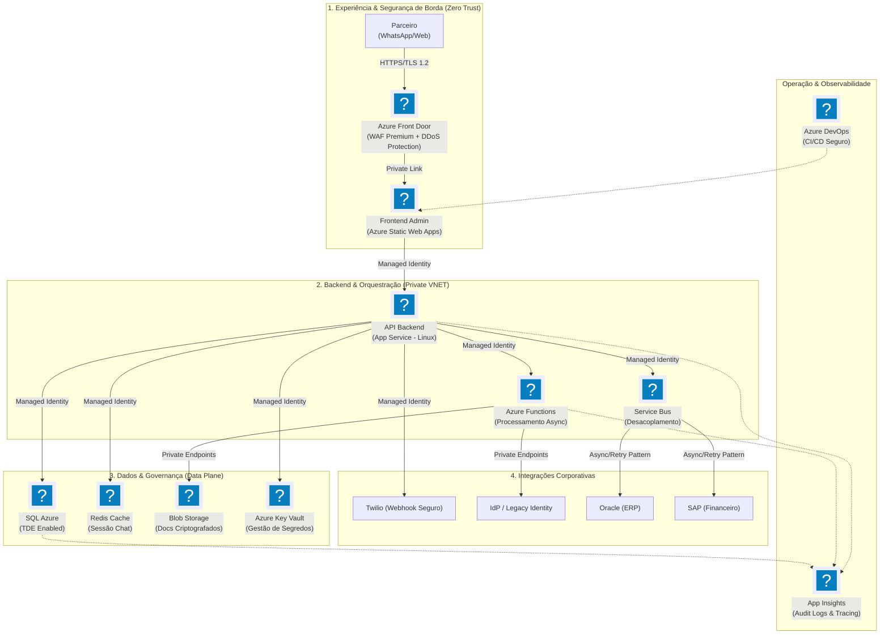
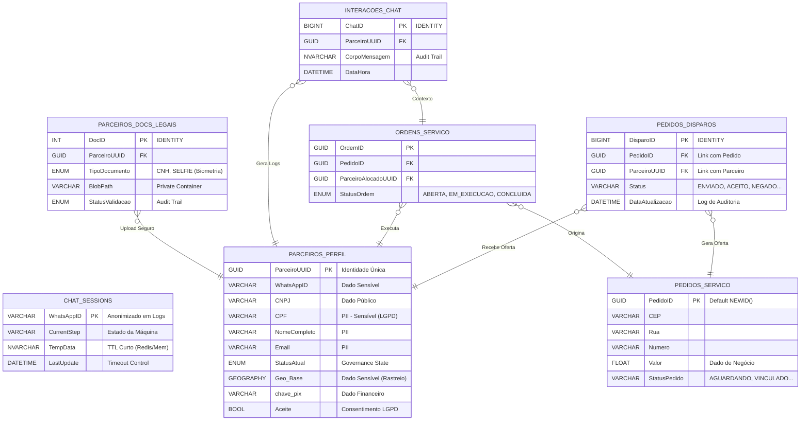

# Documento de Referência de Arquitetura (ARD)
## Plataforma de Gestão de Parceiros via WhatsApp (Peers CodeAI / Aegea)

| Metadado | Detalhe |
| :--- | :--- |
| **Status** | `Em Revisão - Comitê de Segurança` |
| **Data** | `01/02/2026` |
| **Classificação** | `Confidencial` |
| **Autor** | Equipe de Arquitetura |
| **Stakeholders** | Operações, Segurança da Informação, Engenharia |

---

## 1. Resumo Executivo

Esta solução visa orquestrar o ciclo de vida de prestadores de serviço terceiros (Parceiros) para a Aegea/Eurofarma, desde o *onboarding* e validação documental até a execução de ordens de serviço e pagamentos. A interface principal de interação é via **WhatsApp (Twilio)**, suportada por uma arquitetura *Cloud-Native* no Azure.

Este documento detalha a topologia da infraestrutura, o modelo de dados e, principalmente, os controles de segurança aplicados para garantir conformidade com a LGPD e as políticas de InfoSec corporativas.

---

## 2. Diagrama de Infraestrutura & Segurança

A arquitetura segue o padrão de **Segurança em Camadas (Defense in Depth)**, utilizando serviços PaaS gerenciados para reduzir a superfície de ataque e segregar redes públicas de privadas.

### 2.1 Detalhamento dos Controles de Segurança

| Camada | Componente | Controle de Segurança Implementado |
| :--- | :--- | :--- |
| **Borda** | **Azure Front Door** | Atua como WAF (Web Application Firewall) bloqueando OWASP Top 10, SQL Injection e XSS. Terminação TLS/SSL forçada. |
| **Computação** | **App Service / Functions** | Uso estrito de **Managed Identities** para eliminar credenciais hardcoded no código. Isolamento via Integração VNET (Subnet Delegation). |
| **Dados** | **SQL Azure** | Criptografia em repouso (TDE), Firewall lógico (Allow Azure Services only ou Private Endpoint) e Auditoria de Acesso ativada. |
| **Segredos** | **Key Vault** | Centraliza chaves de API (Twilio), Strings de Conexão legado e Certificados. Nenhuma chave reside no repositório de código (Git). |
| **Armazenamento**| **Blob Storage** | Armazena documentos (CNH/Selfie). Acesso via SAS Token de curta duração e expiração automática. Criptografia AES-256. |

---

## 3. Modelo de Dados e Privacidade (LGPD)

O diagrama abaixo ilustra a estrutura de dados relacional. Atenção especial foi dada à segregação de dados sensíveis (PII) e logs de interação, bem como a nova estrutura de `PEDIDOS_DISPAROS` para rastreio de ofertas ativas.

### 3.1 Inventário de Dados Sensíveis e Proteção

A tabela abaixo mapeia os dados críticos identificados no ER Diagram e sua estratégia de proteção:

| Entidade | Dado | Classificação | Estratégia de Proteção |
| :--- | :--- | :--- | :--- |
| **Parceiros** | CPF / Email / Tel | **PII (LGPD)** | Acesso restrito via RBAC na aplicação. Mascaramento em logs de aplicação. |
| **Parceiros** | Selfie / CNH | **Biometria** | Armazenamento em Blob "Hot" Privado no Azure Storage. Acesso apenas via aplicação (Backend Proxy com SAS Token). |
| **Parceiros** | Chave Pix | **Financeiro** | Criptografia a nível de coluna (Always Encrypted) ou restrição severa de visualização via API. |
| **Chat** | Mensagens | **Comunicação** | Retenção definida (ex: 5 anos para fins legais), após isso, expurgo automático (Data Retention Policy). |

---

## 4. Fluxos de Integração e Segurança de Rede

### 4.1 Integração com WhatsApp (Twilio)
Para garantir que apenas a Twilio possa invocar nossos Webhooks e evitar ataques de *Replay* ou *Man-in-the-Middle*:
1.  **Validação de Assinatura:** O Backend valida o header `X-Twilio-Signature` de cada requisição usando o Auth Token armazenado no **Azure Key Vault**.
2.  **HTTPS:** Todo tráfego é criptografado em trânsito (TLS 1.2+).

### 4.2 Integração com Legado (SAP/Oracle/IDW)
A comunicação com os sistemas *on-premise* ou legados não é exposta à internet pública.
1.  **Isolamento:** Utilização de **VNET Integration** nas Azure Functions e App Service.
2.  **Conectividade:** Tráfego roteado via VPN Gateway ou ExpressRoute.
3.  **Credenciais:** Credenciais de banco de dados legados são injetadas em tempo de execução via Key Vault References (o desenvolvedor não vê a senha).

---

## 5. Auditoria e Observabilidade

Todas as ações críticas são auditadas para fins forenses e de conformidade:

* **Application Insights:** Coleta logs de aplicação (Payloads sensíveis são sanitizados antes do log), métricas de performance e falhas.
* **Azure Monitor:** Monitora a saúde e disponibilidade dos recursos PaaS.
* **Log de Auditoria de Banco:** O SQL Azure mantém logs de auditoria sobre quem acessou quais tabelas (Query Store / Audit Logs).
* **Trilha de Aceite:** O campo `Aceite` na tabela `PARCEIROS_PERFIL` armazena o timestamp e versão dos termos de uso aceitos pelo usuário (Requisito Jurídico irrevogável).

---

## 6. Conclusão para o Comitê

A arquitetura proposta utiliza serviços gerenciados (Serverless/PaaS) para minimizar a sobrecarga operacional de patches de segurança e maximizar a disponibilidade. O uso de **Managed Identities** e **Key Vault** garante o princípio de privilégio mínimo e a proteção de segredos. A estrutura de dados foi desenhada considerando a segregação lógica necessária para atender à LGPD, com controles de acesso, criptografia e auditoria nativos da nuvem Azure.
