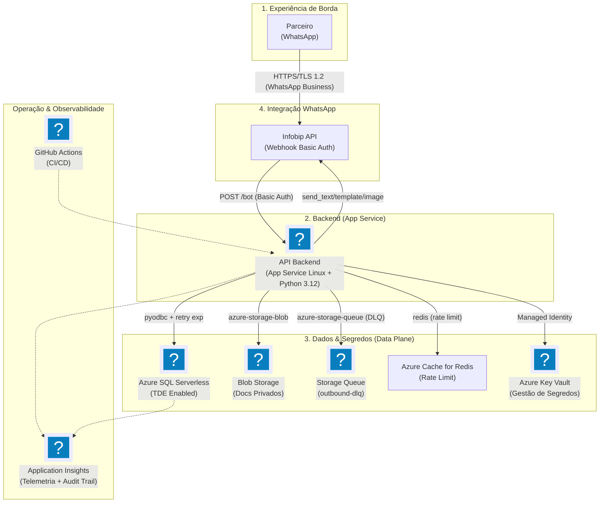
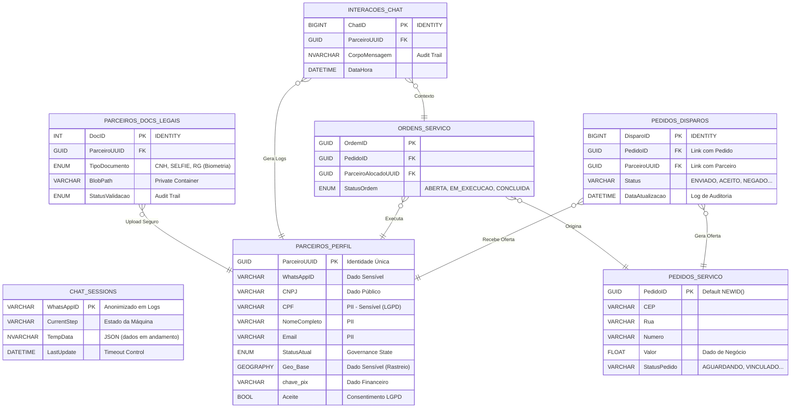

# Documento de Referência de Arquitetura (ARD)
## Plataforma de Gestão de Parceiros via WhatsApp (Peers CodeAI / Aegea)

| Metadado | Detalhe |
| :--- | :--- |
| **Status** | `Vigente — As-Built` |
| **Data** | `13/05/2026` |
| **Classificação** | `Confidencial` |
| **Autor** | Equipe de Arquitetura |
| **Stakeholders** | Operações, Segurança da Informação, Engenharia |

> **Nota sobre escopo:** este documento descreve a arquitetura **efetivamente implementada** (as-built). Para componentes da arquitetura-alvo ainda não implementados, ver Seção 7 (Roadmap Arquitetural).

---

## 1. Resumo Executivo

Esta solução orquestra o ciclo de vida de prestadores de serviço terceiros (Parceiros) para a Aegea/Eurofarma, desde o *onboarding* e validação documental até o disparo de ordens de serviço. A interface principal de interação é via **WhatsApp (API Infobip)**, suportada por uma arquitetura *PaaS* no Azure.

Este documento detalha a topologia da infraestrutura, o modelo de dados e os controles de segurança implementados para garantir conformidade com a LGPD e as políticas de InfoSec corporativas.

---

## 2. Diagrama de Infraestrutura & Segurança (As-Built)

A arquitetura atual usa serviços PaaS gerenciados do Azure, com **Managed Identity** para acesso a segredos e **Basic Auth** no webhook inbound. Componentes adicionais (WAF, isolamento de VNET, frontend admin) estão previstos no Roadmap (Seção 7) mas não foram implementados ainda.

```mermaid
flowchart TB
 subgraph G1["1. Experiência de Borda"]
   direction TB
    USER@{ label: "Parceiro<br>(WhatsApp)" }
 end
 subgraph G2["2. Backend (App Service)"]
   direction TB
    APS["API Backend<br>(App Service Linux + Python 3.12)"]
 end
 subgraph G3["3. Dados & Segredos (Data Plane)"]
   direction TB
    SQL["Azure SQL Serverless<br>(TDE Enabled)"]
    BLOB["Blob Storage<br>(Docs Privados)"]
    SQU["Storage Queue<br>(outbound-dlq)"]
    RED["Azure Cache for Redis<br>(Rate Limit)"]
    KV["Azure Key Vault<br>(Gestão de Segredos)"]
 end
 subgraph G4["4. Integração WhatsApp"]
   direction TB
    INF@{ label: "Infobip API<br>(Webhook Basic Auth)" }
 end
 subgraph OPS["Operação & Observabilidade"]
   direction TB
    GHA["GitHub Actions<br>(CI/CD)"]
    AI["Application Insights<br>(Telemetria + Audit Trail)"]
 end
    USER -- "HTTPS/TLS 1.2 (WhatsApp Business)" --> INF
    INF -- "POST /bot (Basic Auth)" --> APS
    APS -- "Managed Identity" --> KV
    APS -- "pyodbc + retry exp" --> SQL
    APS -- "azure-storage-blob" --> BLOB
    APS -- "azure-storage-queue (DLQ)" --> SQU
    APS -- "redis (rate limit)" --> RED
    APS -- "send_text/template/image" --> INF
    GHA -.-> APS
    APS -.-> AI
    SQL -.-> AI

    APS@{ icon: "azure:app-services", form: "square"}
    SQL@{ icon: "azure:sql-server", form: "square"}
    BLOB@{ icon: "azure:storage-accounts", form: "square"}
    SQU@{ icon: "azure:storage-queues", form: "square"}
    KV@{ icon: "azure:key-vaults", form: "square"}
    GHA@{ icon: "azure:github", form: "square"}
    AI@{ icon: "azure:application-insights", form: "square"}

    classDef area fill:#f9f9f9,stroke:#666,stroke-width:1px,stroke-dasharray: 0
    classDef external fill:#e3f2fd,stroke:#1565c0,stroke-width:1px,stroke-dasharray: 5 5
```

### 2.1 Detalhamento dos Controles de Segurança Implementados

| Camada | Componente | Controle de Segurança Implementado |
| :--- | :--- | :--- |
| **Borda** | **Webhook `/bot`** | Basic Auth via `verify_infobip_basic_auth` (`secrets.compare_digest`, constant-time). Credenciais (`INFOBIP-WEBHOOK-USER`/`PASSWORD`) no Key Vault. Fail-safe: 503 se ausentes, 401 se inválidas. TLS 1.2+ terminado pelo App Service. |
| **Borda** | **Webhook `/admin/*`** | Basic Auth separado via `verify_admin_basic_auth` (`ADMIN-USER`/`ADMIN-PASSWORD` no Key Vault). Mesmo padrão fail-safe. Usado para inspeção e retry manual da DLQ. |
| **Computação** | **App Service Linux** | **Managed Identity** (System-assigned) com role `Key Vault Secrets User` — elimina credenciais hardcoded. Gunicorn + UvicornWorker (4 workers). Python 3.12. |
| **Dados** | **Azure SQL Serverless** | Criptografia em repouso (**TDE** habilitado por default). Firewall lógico (Allow Azure Services). Auditoria de queries via Audit Logs. Connection string montada em runtime a partir de 4 secrets do Key Vault. |
| **Dados** | **Storage Queue `outbound-dlq`** | Fila de Dead-Letter para envios outbound que falharam após retry transient. TTL 7 dias, visibility timeout 5 min no retry admin. Política de 1 ciclo (enqueue → retry manual → delete obrigatório). |
| **Segredos** | **Azure Key Vault** | Centraliza chaves de API (Infobip), credenciais do SQL, connection strings, e credenciais de webhook/admin. **Nenhuma chave reside no Git**. Cache local com singleton — sem TTL (rotacionar exige restart do App Service). RBAC: role `Secrets User` (só leitura) para a Managed Identity. |
| **Armazenamento**| **Blob Storage** | Armazena documentos enviados pelo parceiro (CNH, Selfie, RG). Containers privados (`documentos-parceiros`, `midia-temporaria`) — acesso só via aplicação. Criptografia AES-256 default do Azure Storage. |
| **Observabilidade** | **App Insights** | Telemetria estruturada com mascaramento de PII (`mask_pii` — SHA-256 truncado + salt rotacionável `LOG_PII_SALT`). Custom dimensions canônicas (`OPERATION`, `SENDER_HASH`, `STEP`, etc). Correlation ID middleware (operation_id por request). Ver Seção 5.1. |
| **CI/CD** | **GitHub Actions** | Workflow `main_app-aegea-dev-brazil.yml` faz deploy automático em push para `main`. Publish profile como secret do GitHub (não no Git). |

---

## 3. Modelo de Dados e Privacidade (LGPD)

O diagrama abaixo ilustra a estrutura de dados relacional implementada no Azure SQL. Segregação intencional entre dados sensíveis (PII) e logs de interação; rastreamento de ofertas ativas via `PEDIDOS_DISPAROS`.

```mermaid
erDiagram
    direction BT

    %% ========================================================
    %% TABELAS PRINCIPAIS (Resumo)
    %% ========================================================
    CHAT_SESSIONS {
        VARCHAR WhatsAppID PK "Anonimizado em Logs"
        VARCHAR CurrentStep  "Estado da Máquina"
        NVARCHAR TempData  "JSON (dados em andamento)"
        DATETIME LastUpdate  "Timeout Control"
    }

    PARCEIROS_PERFIL {
        GUID ParceiroUUID PK "Identidade Única"
        VARCHAR WhatsAppID  "Dado Sensível"
        VARCHAR CNPJ  "Dado Público"
        VARCHAR CPF  "PII - Sensível (LGPD)"
        VARCHAR NomeCompleto  "PII"
        VARCHAR Email "PII"
        ENUM StatusAtual  "Governance State"
        GEOGRAPHY Geo_Base  "Dado Sensível (Rastreio)"
        VARCHAR chave_pix  "Dado Financeiro"
        BOOL Aceite  "Consentimento LGPD"
    }

    PARCEIROS_DOCS_LEGAIS {
        INT DocID PK "IDENTITY"
        GUID ParceiroUUID FK ""
        ENUM TipoDocumento  "CNH, SELFIE, RG (Biometria)"
        VARCHAR BlobPath  "Private Container"
        ENUM StatusValidacao "Audit Trail"
    }

    PEDIDOS_SERVICO {
        GUID PedidoID PK "Default NEWID()"
        VARCHAR CEP ""
        VARCHAR Rua ""
        VARCHAR Numero ""
        FLOAT Valor "Dado de Negócio"
        VARCHAR StatusPedido "AGUARDANDO, VINCULADO..."
    }

    PEDIDOS_DISPAROS {
        BIGINT DisparoID PK "IDENTITY"
        GUID PedidoID FK "Link com Pedido"
        GUID ParceiroUUID FK "Link com Parceiro"
        VARCHAR Status "ENVIADO, ACEITO, NEGADO..."
        DATETIME DataAtualizacao "Log de Auditoria"
    }

    ORDENS_SERVICO {
        GUID OrdemID PK ""
        GUID PedidoID FK ""
        GUID ParceiroAlocadoUUID FK ""
        ENUM StatusOrdem  "ABERTA, EM_EXECUCAO, CONCLUIDA"
    }

    INTERACOES_CHAT {
        BIGINT ChatID PK "IDENTITY"
        GUID ParceiroUUID FK ""
        NVARCHAR CorpoMensagem  "Audit Trail"
        DATETIME DataHora  ""
    }

    %% ========================================================
    %% RELACIONAMENTOS DE SEGURANÇA E NEGÓCIO
    %% ========================================================
    PARCEIROS_PERFIL ||--o{ PARCEIROS_DOCS_LEGAIS : "Upload Seguro"
    PARCEIROS_PERFIL ||--o{ INTERACOES_CHAT : "Gera Logs"
    PARCEIROS_PERFIL ||--o{ ORDENS_SERVICO : "Executa"
    PARCEIROS_PERFIL ||--o{ PEDIDOS_DISPAROS : "Recebe Oferta"

    PEDIDOS_SERVICO ||--o{ ORDENS_SERVICO : "Origina"
    PEDIDOS_SERVICO ||--o{ PEDIDOS_DISPAROS : "Gera Oferta"

    ORDENS_SERVICO ||--o{ INTERACOES_CHAT : "Contexto"
```

### 3.1 Inventário de Dados Sensíveis e Proteção

A tabela abaixo mapeia os dados críticos identificados no ER Diagram e sua estratégia de proteção **atual** (controles em roadmap marcados como tal):

| Entidade | Dado | Classificação | Estratégia de Proteção (As-Built) |
| :--- | :--- | :--- | :--- |
| **Parceiros** | CPF / Email / Telefone | **PII (LGPD)** | Acesso restrito pelo backend (autenticação na futura camada de API). Mascaramento em logs via `mask_pii` — SHA-256 truncado + salt rotacionável. |
| **Parceiros** | Selfie / CNH / RG | **Biometria** | Blob privado no Azure Storage (containers `documentos-parceiros` e `midia-temporaria`). Acesso somente via aplicação. Criptografia AES-256 default. ⚠ Acesso por SAS Token de curta duração está no Roadmap (atualmente acesso direto via Managed Identity). |
| **Parceiros** | Chave Pix | **Financeiro** | Armazenado em coluna VARCHAR plana. ⚠ **Always Encrypted (criptografia a nível de coluna) ainda não implementado** — ver Roadmap (Seção 7). Mitigação atual: TDE (em repouso) + acesso restrito pela aplicação. |
| **Chat** | Mensagens (`INTERACOES_CHAT.CorpoMensagem`) | **Comunicação** | Persistido no SQL com TDE. Política de retenção formal pendente — definir antes do go-live em produção. |
| **Sessão** | `CHAT_SESSIONS.TempData` | **Operacional** | Dados em andamento do onboarding (CPF parcial, CEP, etc) — limpos ao final do fluxo via `arquivar_usuario_antigo` em `SessionService`. |

---

## 4. Fluxos de Integração e Segurança de Rede

### 4.1 Integração com WhatsApp (Infobip)

Para garantir que apenas o Infobip possa invocar o webhook inbound e evitar ataques de *Replay* ou *Man-in-the-Middle*:

1. **Basic Auth no Webhook:** No portal Infobip, o perfil de segurança Basic Auth é vinculado ao evento `INBOUND_MESSAGE` e à URL `/bot`. No backend, a dependência FastAPI `verify_infobip_basic_auth` (em `app/api/deps.py`) lê `INFOBIP-WEBHOOK-USER` e `INFOBIP-WEBHOOK-PASSWORD` do **Azure Key Vault** e valida cada requisição com `secrets.compare_digest` (constant-time, resistente a timing attacks). Injetada como `dependencies=[Depends(verify_infobip_basic_auth)]` na rota em `app/api/webhook.py`. Fail-safe: retorna 503 se as credenciais não estão configuradas, 401 se inválidas.
2. **HTTPS:** Todo tráfego é criptografado em trânsito (TLS 1.2+).
3. **Outbound autenticado:** As chamadas para a API Infobip (`send_text`, `send_template`, `send_image`) usam header `Authorization: App <INFOBIP-API-KEY>`, lido do Key Vault. Cliente HTTP único (`InfobipClient`) com retry transient (2 tentativas, backoff exponencial) e persistência em DLQ (`outbound-dlq`) em caso de falha pós-retry.
4. **Histórico:** A integração anterior (Twilio) usava validação de assinatura via header `X-Twilio-Signature`. Substituída por Basic Auth na migração Twilio→Infobip (PR `feat/webhook-basic-auth`).

### 4.2 Recuperação de Falhas Outbound (DLQ)

Envios outbound que falham após retry transient são **persistidos** em `outbound-dlq` (Azure Storage Queue) com payload completo (endpoint, body, sender, destinatário hash). Recuperação manual via endpoints admin autenticados (`ADMIN-USER`/`ADMIN-PASSWORD`):

- `GET /admin/dlq` — lista (peek) até 32 mensagens pendentes; operação read-only.
- `POST /admin/dlq/retry/{message_id}` — re-executa **uma única tentativa** e **deleta obrigatoriamente** a mensagem da fila (sucesso ou falha do retry). Evita fila poluída com mensagens fantasmas re-tentando sozinhas.

Política intencional: zero retry automático após o `transient_retry` esgotar. Cada mensagem tem 1 ciclo de vida: enqueue → retry manual humano → delete. Mensagens não processadas expiram naturalmente em 7 dias (TTL default do Storage Queue).

---

## 5. Auditoria e Observabilidade

Todas as ações críticas são auditadas para fins forenses e de conformidade:

* **Application Insights:** Coleta logs de aplicação (Payloads sensíveis são sanitizados antes do log via `mask_pii`), métricas de performance e falhas. Ver Seção 5.1.
* **Azure Monitor:** Monitora a saúde e disponibilidade dos recursos PaaS.
* **Log de Auditoria de Banco:** O SQL Azure mantém logs de auditoria sobre quem acessou quais tabelas (Query Store / Audit Logs).
* **Trilha de Aceite:** O campo `Aceite` na tabela `PARCEIROS_PERFIL` armazena o timestamp e versão dos termos de uso aceitos pelo usuário (Requisito Jurídico irrevogável).

### 5.1 Telemetria Estruturada (Application Insights)

A aplicação envia telemetria estruturada para o **Azure Application Insights** via biblioteca `azure-monitor-opentelemetry`. Configuração consolidada em `app/core/telemetry.py`. Pontos relevantes para Segurança e Governança:

| Aspecto | Implementação |
| :--- | :--- |
| **Auto-instrumentação** | FastAPI (requests inbound), `requests`/`httpx` (HTTP outbound) e `pyodbc` (SQL) instrumentados sem código manual. Captura `requestTelemetry`, `dependencyTelemetry` e `exceptionTelemetry` automaticamente. |
| **Custom Dimensions canônicas** | Vocabulário central em `app/core/log_dimensions.py` (`operation`, `step`, `sender_hash`, `external_service`, `duration_ms`, etc) — viabiliza queries Kusto consistentes. |
| **Mascaramento de PII (LGPD)** | Função `mask_pii(value)` aplica SHA-256 truncado (12 chars) com salt rotacionável via env var `LOG_PII_SALT`. Determinístico — permite correlação por usuário sem reidentificação. Aplicado a WhatsApp ID, CPF, CNPJ, e-mail em todos os logs estruturados. |
| **Correlation ID** | Middleware FastAPI atribui `operation_id` por request (header `X-Operation-Id` propagado). Injetado em todas as `customDimensions` via `logging.Filter` — permite query "todos os logs deste webhook". |
| **Níveis de log** | `LOG_LEVEL` em env var. Default `INFO` em produção. `DEBUG` apenas em investigação temporária. |
| **Conexão** | `APPLICATIONINSIGHTS_CONNECTION_STRING` configurada em App Service Settings (não vai pro código). |

#### Garantias adicionais para LGPD

- Logs de inbound (`webhook_inbound`) **nunca** contêm o conteúdo da mensagem do usuário — apenas `message_type` e `message_len`.
- Coordenadas GPS de parceiros vão para nível **DEBUG** (não persiste em produção).
- Query de sanity check (regex CPF/CNPJ em `traces.message`) executada após cada release detecta vazamentos acidentais — se retornar resultados, abrir incidente.

---

## 6. Conclusão para o Comitê

A arquitetura atual utiliza serviços PaaS gerenciados (App Service Linux, SQL Serverless, Blob Storage, Storage Queue, Key Vault, Application Insights) para minimizar a sobrecarga operacional de patches de segurança. O uso de **Managed Identity** e **Key Vault** garante o princípio de privilégio mínimo e a proteção de segredos. Logs e auditoria nativos da nuvem Azure cobrem os requisitos forenses da LGPD, com mascaramento de PII determinístico e rotacionável.

Há gaps explícitos em relação à arquitetura-alvo de longo prazo (Front Door, isolamento de VNET, frontend admin, integrações ERP), documentados na Seção 7 abaixo para acompanhamento do comitê.

---

## 7. Roadmap Arquitetural (Componentes Não Implementados)

Esta seção lista os componentes da arquitetura-alvo que **ainda não estão em produção** mas que foram considerados no design inicial. São candidatos a próximos PRs, e devem ser avaliados pelo comitê de segurança conforme prioridade de risco.

| Componente | Categoria | Justificativa para incluir |
| :--- | :--- | :--- |
| **Azure Front Door + WAF** | Borda | Proteção WAF (OWASP Top 10), DDoS, rate limiting. Hoje o App Service está exposto diretamente — TLS terminado nele. |
| **VNET Integration + Private Endpoints** | Rede | Isolar SQL/Blob/Key Vault para acesso apenas via rede privada. Hoje SQL usa firewall lógico "Allow Azure Services" (allowlist aberta). |
| **Frontend Admin (Static Web Apps)** | UI | Console para operação visualizar DLQ, status de parceiros, ordens. Hoje só há endpoints REST acessados via curl/Postman. |
| **Azure Functions / Worker async** | Processamento | Mover envios outbound de WhatsApp pra worker desacoplado. Hoje cada request bloqueia thread no App Service via `threading.Thread` (ver `ARCHITECTURE.md` → Pontos de fragilidade). |
| **Azure Service Bus** | Mensageria | Substituir Storage Queue (DLQ + futuro pipeline outbound) caso volume cresça acima de ~32 msg/min e exija sessions/topics. Hoje Storage Queue é suficiente e mais barata. |
| **Redis Cache (sessão)** | Cache | Mover `CHAT_SESSIONS.TempData` pra Redis para reduzir leitura/escrita no SQL. Hoje cada turn do bot é 1-3 queries no SQL Serverless. |
| **Always Encrypted em `chave_pix`** | Cripto | Criptografia a nível de coluna no SQL Server — chave permanece no cliente (mesmo um DBA não vê o valor). Hoje só TDE (proteção em repouso). |
| **Integrações ERP (SAP, Oracle, IdP)** | Negócio | Mock de CNPJ ainda inline em `etapa_pessoal.processar_cnpj`. Bloqueador para go-live em produção (substituir por Serpro/Receita Federal). ViaCEP e Google Maps já são chamadas reais. |
| **Migrations versionadas** | Operacional | Schema do SQL atualmente é criado manualmente. PR `feat/migrations` planejada para versionar evolução do schema. |
| **Slot staging + swap** | Deploy | Deploy atual é direto na produção em push pra `main`. Slot permitiria rollback por swap em vez de revert+redeploy. |

Priorização sugerida (não vinculante): **Front Door (WAF) > Private Endpoints (SQL) > Always Encrypted (chave_pix) > Service Bus > Frontend Admin**.

---

## Atualização deste documento

Sempre que adicionar:

- **Novo componente Azure provisionado** → atualizar Seções 2, 2.1 e remover da Seção 7 (Roadmap).
- **Novo dado sensível** → atualizar Seção 3.1 (Inventário).
- **Novo fluxo de integração** → adicionar subseção em 4.
- **Novo controle de segurança** → atualizar Seção 2.1 e mencionar em 6 (Conclusão) se for material para o comitê.

Use a skill `repo-documentation` (modo update) para detectar drift entre o código e este documento quando houver mudanças significativas.
