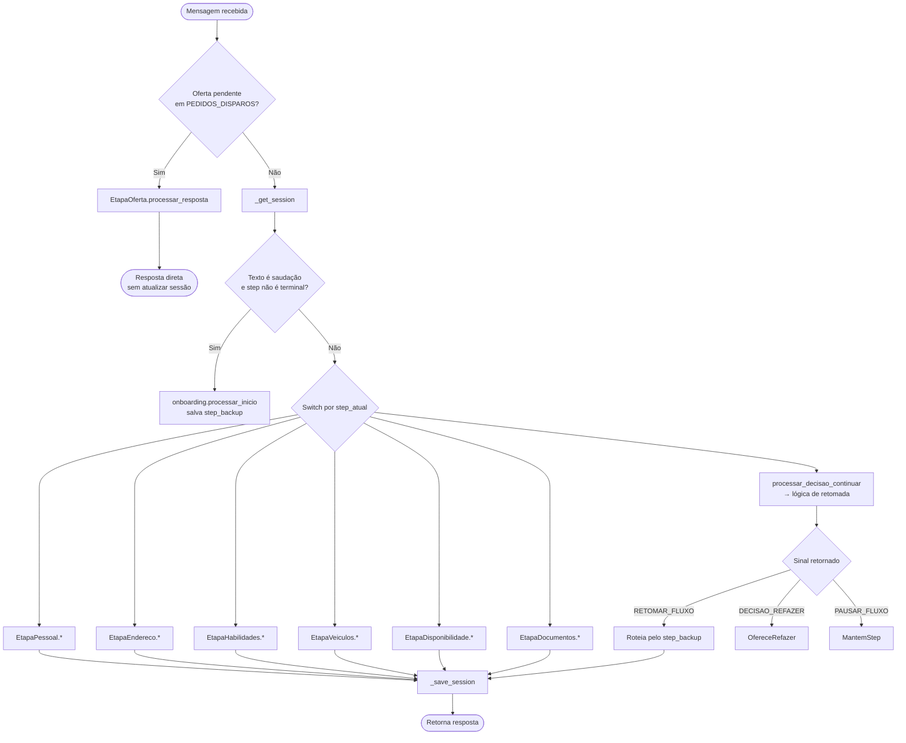

# Módulo: bot_engine

> Orquestrador central do chat. Máquina de estados que decide, a cada mensagem do parceiro, qual etapa do funil chamar e em qual estado salvar.

## Propósito

O `BotEngine` é o ponto único onde **todas as mensagens recebidas via WhatsApp são processadas**. Ele:

1. Carrega o estado atual da sessão do parceiro (banco).
2. Roteia a mensagem para a etapa correspondente (`EtapaPessoal`, `EtapaEndereco`, etc).
3. Salva o novo estado.
4. Retorna a resposta a enviar de volta.

Reside em arquivo único (`app/bot_engine.py`, 263 linhas) — não foi quebrado em sub-módulos intencionalmente, pois centralizar o switch facilita ver o fluxo completo.

## Estrutura

| Atributo | Tipo | Uso |
|---|---|---|
| `db` | `DatabaseManager` | Lê/grava `CHAT_SESSIONS` |
| `onboarding` | `ModuloOnboarding` | Entrada, decisões iniciais |
| `pessoal`, `endereco`, `habilidades`, `veiculos`, `disponibilidade`, `documentos`, `oferta` | Etapas | Lógica de campo |
| `MAPA_RETOMADA` | `dict[str, str]` | Mensagem de "retomando..." por step, usada após timeout |
| `SAUDACOES` | `list[str]` | Palavras que disparam menu inicial |

## API pública

```python
class BotEngine:
    def __init__(self) -> None: ...
    def processar_mensagem(
        self,
        sender_id: str,
        mensagem_texto: str,
        media_url: str | None = None,
    ) -> dict: ...
```

**Como é usado:**

- Chamado pelo `main.chat_webhook` para cada `result` no payload do Infobip.
- Retorna um dict `resposta_bot` (formato em [`ARCHITECTURE.md → padrão de mensagem`](../ARCHITECTURE.md#padr%C3%A3o-de-mensagem)).
- Erros são capturados e retornam `{'tipo': 'texto', 'conteudo': 'Erro interno...'}` — não levanta exceção.

**Métodos privados relevantes:**

- `_get_session(sender_id)` → `(step_atual, dados_dict)`. Aplica **timeout de 5 minutos** — se a última interação foi há mais de 300s, força `step = 'START'` e salva `step_backup` em `dados`.
- `_save_session(sender_id, step, dados)` — `MERGE` em `CHAT_SESSIONS`. Pula steps transitórios (`START`, `NO_UPDATE`) para não criar registros lixo.

## Fluxo



## Comportamentos não óbvios

### 1. Interceptação de oferta pendente (linhas 102–107)

Antes de qualquer outra coisa, o engine verifica se há oferta `ENVIADO` na `PEDIDOS_DISPAROS` para esse `WhatsAppID`. Se houver, **o cadastro é interrompido** e a resposta é tratada como aceite/recusa de oferta.

> **Por quê:** o parceiro pode estar no meio do cadastro e receber uma oferta urgente — precisa poder responder à oferta sem perder progresso no cadastro.

### 2. Timeout de sessão de 5 minutos (linhas 67–73)

Se passou mais de 300 segundos desde a última interação, o `step_atual` é forçado para `'START'` mas o **step real** é salvo em `dados['step_backup']`.

Isso permite que, no próximo turno, o `ModuloOnboarding` ofereça "continuar de onde parou" usando o `step_backup`.

### 3. Lógica central de retomada (linhas 138–200)

Quando o usuário responde "sim, continuar" após timeout, o engine **inspeciona o `step_backup`** e decide qual etapa retomar:

- Step contém `'VEICULO'` → `EtapaVeiculos`
- Step contém `'DISPONIBILIDADE'` → `EtapaDisponibilidade`
- Step contém `'HABILIDADE'` → `EtapaHabilidades`
- Step em `['AGUARDANDO_CNPJ', 'AGUARDANDO_CPF', 'AGUARDANDO_NOME', 'AGUARDANDO_EMAIL']` → `EtapaPessoal`
- Step relacionado a documentos → `EtapaDocumentos`
- **Fallback**: usa `MAPA_RETOMADA` (mensagem genérica de retomada por step)

> **Por quê:** evita o usuário ter que recomeçar do zero após uma pausa longa.

### 4. Saudações com backup

Se o usuário envia "oi"/"olá"/"menu" no meio de um cadastro, o engine **salva o step atual em `step_backup`** antes de mostrar o menu de novo. Permite voltar ao mesmo ponto se o user escolher "continuar".

### 5. Bloqueio de salvamento em steps transitórios

`_save_session` ignora se `step in ['START', 'NO_UPDATE']`. Sem isso, todo turno geraria um update no banco (mesmo quando nada mudou).

## O grande `if/elif`

Linhas 212–250 são um switch gigante por `step_atual`. **Não refatorar para FSM declarativa sem necessidade** — a ordem dos elifs codifica precedência (ex: `'DOCUMENTOS'` antes do fallback genérico), e o padrão `step.startswith('AGUARDANDO_X')` mistura match exato com prefixo. Reescrever isso pra FSM-table tem alto risco de bug sutil.

Se o switch crescer muito, considerar:

- **Tabela de dispatch**: `STEP_HANDLERS = {'AGUARDANDO_CNPJ': self.pessoal.processar_cnpj, ...}`.
- **Sub-roteadores por grupo** (já existe parcialmente — bot delega pra cada etapa).

## Erros conhecidos / fragilidades

- **Sem logs estruturados** — `print` por todo lado. Application Insights captura, mas filtragem fica difícil.
- **`traceback.print_exc()` em produção** — em caso de erro, stack vai pro stdout. Considerar `logging.exception()`.
- **`processar_inicio` é chamado tanto no caminho de erro quanto no normal** — duplicação de comportamento esperado/inesperado.
- **Resposta genérica em caso de erro** (`"Ocorreu um erro interno"`) — não diferencia validação vs sistema.

## Configurações

Tabelas SQL lidas/gravadas:

| Tabela | Operação |
|---|---|
| `CHAT_SESSIONS` | `SELECT` + `MERGE` (estado da máquina) |

Indiretamente, via etapas e services, toca `PARCEIROS_PERFIL`, `PEDIDOS_DISPAROS`, etc.

## O que NÃO está aqui

- **Validação de campo** → cada `EtapaX.processar_<campo>`
- **Envio de mensagens** → `WhatsAppService` ou `InfobipClient` (chamado por `main.chat_webhook`)
- **Persistência de dados do parceiro** → `ParceiroService`
- **Templates de WhatsApp** → cadastrados no portal Infobip
