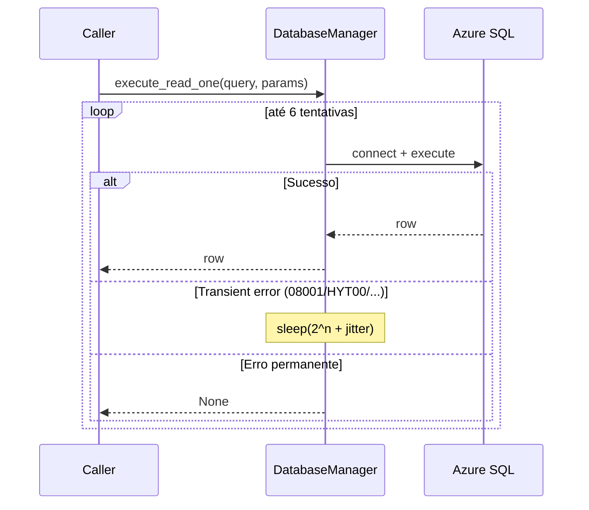

# Módulo: core

> Infraestrutura compartilhada: leitura de secrets do Azure Key Vault e acesso resiliente ao SQL Server.

## Propósito

Centraliza dois recursos transversais que toda a aplicação consome:

- **Settings** — singleton com cache local para evitar round-trips no Key Vault a cada leitura de secret.
- **DatabaseManager** — wrapper sobre `pyodbc` com retry exponencial para tolerar a latência de cold start do Azure SQL Serverless.

## Estrutura

| Arquivo | Classe principal | Responsabilidade |
|---|---|---|
| `config.py` | `Settings` | Lê secrets do Azure Key Vault (cache local) |
| `database.py` | `DatabaseManager` | Conexão e queries no Azure SQL com retry |

## API pública

### `Settings`

```python
class Settings:
    def __new__(cls) -> "Settings": ...           # singleton
    def get_secret(self, secret_name: str) -> str: ...
    def get_all_secrets(self, secret_names: list[str]) -> dict[str, str]: ...
```

**Como é usado:**

- Importado em todo serviço/módulo que precisa de credencial (`InfobipClient`, `DatabaseManager`, `AzureBlobService`, etc).
- Singleton — só uma instância por processo. Cache de secrets é compartilhado entre todos os callers.

**Pontos não óbvios:**

- Lê a URL do vault da variável de ambiente `AZURE_KEYVAULT_URL` no `_init`. Se ausente, **levanta `RuntimeError` no construtor** — falha rápido em vez de propagar erro só no primeiro `get_secret`.
- Cache **não tem TTL nem invalidação** — pra pegar mudança de secret é necessário reiniciar o processo. Trade-off intencional: minimiza latência em troca de baixa frequência de rotação de secrets.
- Usa `DefaultAzureCredential` — funciona com Managed Identity em App Service / Functions, ou com `az login` em dev local.

### `DatabaseManager`

```python
class DatabaseManager:
    def execute_read_one(self, query: str, params: tuple | None = None) -> Any: ...
    def execute_write(self, query: str, params: tuple | None = None) -> bool: ...
    def execute_transaction(self, queries_with_params: list[tuple[str, tuple]]) -> bool: ...
```

**Como é usado:**

- Instanciado pelos services (`ParceiroService`, `SessionService`, etc) — cada service tem seu próprio manager.
- Connection string montada uma vez no `__init__` a partir dos secrets `DB-SERVER`, `DB-NAME`, `DB-USER`, `DB-PASSWORD`.
- Não usa pool de conexões — abre/fecha conexão a cada query.

**Pontos não óbvios:**

- **Retry com backoff exponencial**: 6 tentativas, `2 * (2 ** attempt) + jitter` segundos entre elas. Específico para tolerar Azure SQL **Serverless dormindo** (cold start de até 1 minuto). Sem isso, primeiro request após inatividade falha.
- **Erros considerados transientes**: códigos `08001`, `HYT00`, `08S01`, `10054` + qualquer erro com `"TCP Provider"` no texto. Outros erros (sintaxe SQL, FK violation, etc) **não** disparam retry — falham na primeira tentativa.
- `execute_read_one` retorna `None` em erro **e** quando a query não retorna linhas. Callers precisam distinguir pelo contexto.
- `execute_write` retorna `bool` (`True` = sucesso). Convém usar essa flag para gatilhar lógica downstream que dependa do write.
- `execute_transaction` tem **retry simplificado** (4 tentativas só na conexão inicial, sem backoff). Pra workloads críticos de transação, considerar revisitar.

## Fluxo interno



## Configurações

Secrets lidos do Key Vault por este módulo:

| Secret | Lido em | Uso |
|---|---|---|
| `DB-SERVER` | `DatabaseManager.__init__` | Endereço do SQL Server |
| `DB-NAME` | `DatabaseManager.__init__` | Nome do banco |
| `DB-USER` | `DatabaseManager.__init__` | Usuário SQL |
| `DB-PASSWORD` | `DatabaseManager.__init__` | Senha SQL |

Variáveis de ambiente:

| Variável | Lido em | Uso |
|---|---|---|
| `AZURE_KEYVAULT_URL` | `Settings._init` | URL do vault (obrigatório) |

## O que NÃO está aqui

- **Conexões para outros bancos** (Redis, etc.) — não há.
- **ORM ou query builder** — uso direto de `pyodbc` com placeholders `?`.
- **Migrations** — esquema gerenciado fora do código.
- **Healthcheck do banco** — não há endpoint dedicado (o `GET /` em `main.py` só checa que o processo está vivo).
