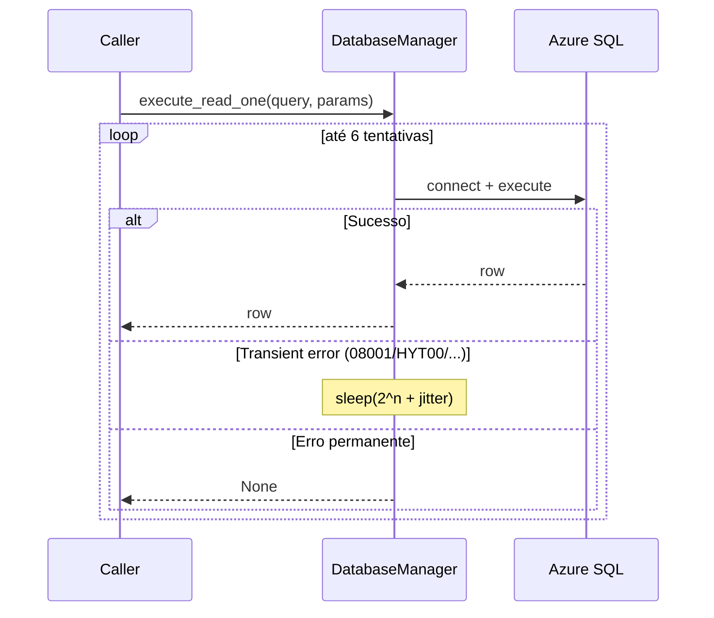

# Módulo: core

> Infraestrutura compartilhada: secrets do Key Vault, acesso resiliente ao SQL Server, e telemetria estruturada para Application Insights.

## Propósito

Centraliza recursos transversais que toda a aplicação consome:

- **Settings** — singleton com cache local para evitar round-trips no Key Vault a cada leitura de secret.
- **DatabaseManager** — wrapper sobre `pyodbc` com retry exponencial para tolerar a latência de cold start do Azure SQL Serverless.
- **Telemetry** — bootstrap do `azure-monitor-opentelemetry`, factory de logger, mascaramento de PII e middleware de correlation ID.
- **Log dimensions** — constantes canônicas para custom dimensions no Application Insights (evita typos em queries Kusto).
- **Retry** — decorator pré-configurado `transient_retry` aplicado em chamadas HTTP externas (Infobip, Blob download, ViaCEP, Google Maps). Política única centralizada: 2 tentativas, backoff exponencial, retry só em transient.
- **Rate limit** — `slowapi` Limiter com Redis storage configurado **tardiamente** pelo lifespan (`configure_redis_storage`), mantendo o module-load barato.
- **Azure auth** — scheme JWT Azure AD inicializado **tardiamente** pelo lifespan (`configure_azure_auth(settings)`), evitando I/O Key Vault em cada boot de worker Gunicorn.

## Estrutura

| Arquivo | Classe principal | Responsabilidade |
|---|---|---|
| `config.py` | `Settings` | Lê secrets do Azure Key Vault (cache local) |
| `database.py` | `DatabaseManager` | Conexão e queries no Azure SQL com retry |
| `telemetry.py` | `configure_telemetry`, `get_logger`, `mask_pii`, `correlation_id_middleware` | Bootstrap App Insights + PII masking + correlation ID |
| `log_dimensions.py` | (módulo de constantes) | Vocabulário canônico das custom dimensions (`OPERATION`, `SENDER_HASH`, `STEP`, etc.) |
| `retry.py` | `is_transient_http_error`, `transient_retry` | Decorator de retry para chamadas HTTP externas (Infobip, Blob, ViaCEP, Google Maps): 2 tentativas, backoff exponencial 1-5s, retry só em transient (timeout/connection/5xx). |
| `rate_limit.py` | `limiter`, `configure_redis_storage` | `slowapi.Limiter` exposto a routers + `configure_redis_storage(conn_str)` chamado pelo lifespan startup pra trocar storage in-memory por Redis. |
| `azure_auth.py` | `configure_azure_auth`, `get_azure_scheme`, `get_init_error` | `SingleTenantAzureAuthorizationCodeBearer` (`fastapi-azure-auth`) com lazy-init pelo lifespan. `verify_dispatch_auth` (em `app/api/deps.py`) lê `get_azure_scheme()` dinamicamente a cada request. |

## API pública

### `Settings`

```python
class Settings:
    def __new__(cls) -> "Settings": ...           # singleton
    def get_secret(self, secret_name: str) -> str: ...
    def get_all_secrets(self, secret_names: list[str]) -> dict[str, str]: ...
```

**Como é usado:**

- Importado em todo serviço/módulo que precisa de credencial (`InfobipClient`, `DatabaseManager`, `AzureBlobService`, etc).
- Singleton — só uma instância por processo. Cache de secrets é compartilhado entre todos os callers.

**Pontos não óbvios:**

- Lê a URL do vault da variável de ambiente `AZURE_KEYVAULT_URL` no `_init`. Se ausente, **levanta `RuntimeError` no construtor** — falha rápido em vez de propagar erro só no primeiro `get_secret`.
- Cache **não tem TTL nem invalidação** — pra pegar mudança de secret é necessário reiniciar o processo. Trade-off intencional: minimiza latência em troca de baixa frequência de rotação de secrets.
- Usa `DefaultAzureCredential` — funciona com Managed Identity em App Service / Functions, ou com `az login` em dev local.

### `DatabaseManager`

```python
class DatabaseManager:
    def execute_read_one(self, query: str, params: tuple | None = None) -> Any: ...
    def execute_write(self, query: str, params: tuple | None = None) -> bool: ...
    def execute_transaction(self, queries_with_params: list[tuple[str, tuple]]) -> bool: ...
```

**Como é usado:**

- Instanciado pelos services (`SessionService`, `DispatchService`) e diretamente pelos módulos de etapa (`etapa_pessoal`, `etapa_endereco`, etc) — cada componente tem seu próprio manager.
- Connection string montada uma vez no `__init__` a partir dos secrets `DB-SERVER`, `DB-NAME`, `DB-USER`, `DB-PASSWORD`.
- Não usa pool de conexões — abre/fecha conexão a cada query.

**Pontos não óbvios:**

- **Retry com backoff exponencial**: 6 tentativas, `2 * (2 ** attempt) + jitter` segundos entre elas. Específico para tolerar Azure SQL **Serverless dormindo** (cold start de até 1 minuto). Sem isso, primeiro request após inatividade falha.
- **Erros considerados transientes**: códigos `08001`, `HYT00`, `08S01`, `10054` + qualquer erro com `"TCP Provider"` no texto. Outros erros (sintaxe SQL, FK violation, etc) **não** disparam retry — falham na primeira tentativa.
- `execute_read_one` retorna `None` em erro **e** quando a query não retorna linhas. Callers precisam distinguir pelo contexto.
- `execute_write` retorna `bool` (`True` = sucesso). Convém usar essa flag para gatilhar lógica downstream que dependa do write.
- `execute_transaction` tem **retry simplificado** (4 tentativas só na conexão inicial, sem backoff). Pra workloads críticos de transação, considerar revisitar.

## Fluxo interno



## Configurações

Secrets lidos do Key Vault por este módulo:

| Secret | Lido em | Uso |
|---|---|---|
| `DB-SERVER` | `DatabaseManager.__init__` | Endereço do SQL Server |
| `DB-NAME` | `DatabaseManager.__init__` | Nome do banco |
| `DB-USER` | `DatabaseManager.__init__` | Usuário SQL |
| `DB-PASSWORD` | `DatabaseManager.__init__` | Senha SQL |

Variáveis de ambiente:

| Variável | Lido em | Uso |
|---|---|---|
| `AZURE_KEYVAULT_URL` | `Settings._init` | URL do vault (obrigatório) |
| `APPLICATIONINSIGHTS_CONNECTION_STRING` | `configure_telemetry` | Conexão com App Insights (opcional — sem ela cai em stdout) |
| `LOG_LEVEL` | `configure_telemetry` | Nível raiz (default `INFO`) |
| `LOG_PII_SALT` | `mask_pii` | Salt do hash SHA-256 (default fallback se ausente, mas defina em prod) |

### Telemetria — `telemetry.py`

```python
def configure_telemetry() -> None: ...                       # chamar uma vez no startup, ANTES de FastAPI()
def get_logger(name: str) -> logging.Logger: ...             # logger por módulo
def mask_pii(value: Any, length: int = 12) -> str: ...       # SHA-256 truncado com salt rotacionável
async def correlation_id_middleware(request, call_next): ... # injetar via app.middleware("http")(...)
```

**Como é usado:**

- `configure_telemetry()` é a **primeira instrução** de `main.py` — chamada antes de criar a FastAPI app. Auto-instrumentação só funciona se rodar nessa ordem.
- Cada módulo cria seu logger no topo: `logger = get_logger(__name__)`.
- `mask_pii` é aplicado em todo log que toca identificador PII (WhatsApp ID, CPF, CNPJ, e-mail).
- O middleware `correlation_id_middleware` atribui `operation_id` por request — propagado em todas as `custom_dimensions` via `_OperationIdFilter` (instalado automaticamente).

**Pontos não óbvios:**

- **Sem `APPLICATIONINSIGHTS_CONNECTION_STRING`** o módulo cai em fallback: configura `logging.basicConfig` com formato compacto pro stdout. Útil em dev local.
- O `_PII_SALT` é lido de `LOG_PII_SALT` env var. Rotacionar invalida correlações de logs antigos (efeito intencional — descarta histórico se houver vazamento do salt).
- `mask_pii` é **determinístico** — não usa `os.urandom`. Mesmo identificador sempre gera mesmo hash.
- Auto-instrumentação habilitada: `fastapi`, `requests`, `urllib3`, `azure_sdk`. **Desabilitada**: `django`, `flask` (não usamos).

### Dimensions canônicas — `log_dimensions.py`

Módulo só com constantes. Use-as em vez de strings literais para evitar typos e facilitar refactor:

```python
from app.core import log_dimensions as ld

logger.info("evento", extra={"custom_dimensions": {
    ld.OPERATION: "process_message",
    ld.SENDER_HASH: mask_pii(sender_id),
    ld.STEP: "AGUARDANDO_CPF",
}})
```

Constantes principais: `OPERATION`, `STEP`, `STEP_FROM`/`STEP_TO`, `SENDER_HASH`, `PARCEIRO_HASH`, `PEDIDO_ID`, `COMPONENT`, `DURATION_MS`, `EXTERNAL_SERVICE`/`EXTERNAL_STATUS`, `RESULT`, `MESSAGE_TYPE`/`MESSAGE_LEN`, `TIPO`, `MOCK`, `MISSING_SECRETS`.

### Rate limit — `rate_limit.py`

```python
limiter: Limiter                                  # singleton exposto a routers
def configure_redis_storage(connection_string: str | None) -> None: ...
```

**Como é usado:**

- O `Limiter(key_func=get_remote_address)` é criado no module-load com storage **in-memory** — barato e seguro pra rodar em testes / dev local sem Redis.
- `main.py` chama `configure_redis_storage(redis_conn)` no lifespan startup, lendo `REDIS-CONNECTION-STRING` do Key Vault via `app.state.settings`. A função troca o `_storage_uri` interno e invalida o `cached_property` `_storage` do `Limiter` — Redis passa a valer a partir do próximo request.
- Routers usam decorators `@limiter.limit("30/minute")` em endpoints sensíveis (`/bot`, `/admin/*`, `/api/dispatch`).

**Pontos não óbvios:**

- **Por que lazy-init e não module-load**: ler `REDIS-CONNECTION-STRING` no import força I/O Key Vault em cada boot de worker Gunicorn (4 workers × N instâncias = N×4 leituras só pra subir o processo). Lazy-init move pro lifespan, que roda 1× depois do `Settings` singleton já estar populado.
- **Parsing do formato Azure Cache**: a connection string vem como `host:port,password=X,ssl=True`; é convertida pra URI `slowapi`/`limits` (`rediss://:X@host:port/0`).
- **Fallback**: se `REDIS-CONNECTION-STRING` estiver ausente ou Redis cair, o `Limiter` continua funcionando in-memory (degradação parcial — limite efetivo multiplica por N_workers × N_instâncias, mas o app não quebra).

### Azure AD auth — `azure_auth.py`

```python
def configure_azure_auth(settings) -> bool: ...                # roda no lifespan startup
def get_azure_scheme() -> SingleTenantAzureAuthorizationCodeBearer | None: ...
def get_init_error() -> str | None: ...                        # útil pro 503 detail
```

**Como é usado:**

- `main.py` chama `configure_azure_auth(app.state.settings)` no lifespan startup, lendo `AZURE-AD-TENANT-ID` e `AZURE-AD-API-CLIENT-ID`. Se algum secret faltar, registra `_init_error` e `_azure_scheme` continua `None`.
- O wrapper `verify_dispatch_auth` em `app/api/deps.py` chama `get_azure_scheme()` **a cada request** — não cacheia no escopo do módulo. Garante que o scheme configurado depois do load do módulo seja visto imediatamente.

**Pontos não óbvios:**

- **Por que lazy-init**: mesma motivação do `rate_limit` — antes, o módulo tentava inicializar no import, o que rodava I/O Key Vault em cada boot Gunicorn e podia falhar antes do app responder qualquer probe.
- **Estado global do scheme**: `_azure_scheme` e `_init_error` ficam em escopo de módulo. Apenas `configure_azure_auth` os modifica; testes podem `mocker.patch.object(azure_auth, "_azure_scheme", None)` pra forçar o 503.
- **Validação JWT offline**: o `SingleTenantAzureAuthorizationCodeBearer` cacheia as chaves públicas do tenant Azure AD (refresh a cada 24h). Cada request faz validação assinada localmente, sem ida à internet.

## O que NÃO está aqui

- **Conexões para outros bancos** (Redis, etc.) — não há.
- **ORM ou query builder** — uso direto de `pyodbc` com placeholders `?`.
- **Migrations** — esquema gerenciado fora do código.
- **Healthcheck do banco** — não há endpoint dedicado (o `GET /` em `main.py` só checa que o processo está vivo).
